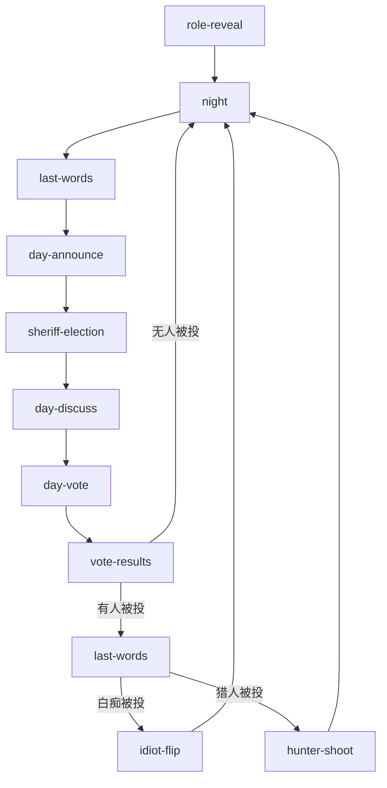

# AI 狼人杀模块 Bug / 问题清单

> 项目: `C:\Users\Administrator\ai-tool-launcher\src\components\life\werewolf\`
> 涉及文件: `Game.tsx` (3202 行) / `engine.ts` (639 行) / `data.ts` (280 行) / `Personalities.tsx` (27 行)
> 审查日期: 2026-06-08
> 严重度图例:
> - 🔴 **P0** 破坏游戏可玩性(卡死、算出致命错误、规则完全失效)
> - 🟠 **P1** 规则细节错误 / 状态机错位 / 关键逻辑缺失
> - 🟡 **P2** UX 体验差 / 类型不一致 / 代码异味
> - 🟢 **P3** 体验细节 / 美化建议 / 性能优化

---

## 目录

- [第一部分:🔴 P0 — 致命问题(6 条)](#第一部分p0--致命问题6-条)
- [第二部分:🟠 P1 — 规则/状态机(16 条)](#第二部分p1--规则状态机问题16-条)
- [第三部分:🟡 P2 — UX / 代码质量(13 条)](#第三部分p2--ux--代码质量13-条)
- [第四部分:🟢 P3 — 体验细节(10 条)](#第四部分p3--体验细节10-条)
- [第五部分:专项汇总](#第五部分专项汇总)
  - [A. 代码层面的问题](#a-代码层面的问题)
  - [B. 逻辑层面的问题](#b-逻辑层面的问题)
  - [C. 游戏机制层面的问题](#c-游戏机制层面的问题)
- [第六部分:修复优先级建议](#第六部分修复优先级建议)
- [第七部分:补充问题(用户反馈第一轮,4 条)](#第七部分补充问题用户反馈第一轮4-条)
- [第八部分:补充问题(用户反馈第二轮,6 条)](#第八部分补充问题用户反馈第二轮6-条)
- [第九部分:补充问题汇总(第二轮)](#第九部分补充问题汇总第二轮)
- [第十部分:全部 Bug 总数(更新)](#第十部分全部-bug-总数更新)
- [第十一部分:三层面汇总(更新)](#第十一部分三层面汇总更新)
- [第十二部分:修复优先级更新(3 波)](#第十二部分修复优先级更新3-波)

---

# 总览速查表

| 严重度 | 数量 | 列表编号 |
|---|---|---|
| 🔴 **P0** | **11 条** | #1 #2 #3 #4 #5 #6 #46 #47 #51 #52 #53 |
| 🟠 **P1** | **19 条** | #7 #8 #9 #10 #11 #12 #13 #14 #15 #16 #17 #18 #19 #20 #21 #22 #48 #49 #54 #55 |
| 🟡 **P2** | **13 条** | #23 #24 #25 #26 #27 #28 #29 #30 #31 #32 #33 #34 #35 |
| 🟢 **P3** | **13 条** | #36 #37 #38 #39 #40 #41 #42 #43 #44 #45 #50 #56 |
| **合计** | **56 条** | |

---

# 第一部分:P0 — 致命问题(6 条)

---

## 🔴 P0-#1: `sheriff-pick-order` 阶段在 UI 完全没实现 → 12 人局会卡死

**严重度**: 🔴 P0
**文件**: `Game.tsx` / `engine.ts` / `data.ts`
**关联行号**:
- `data.ts:27` — Phase 枚举里定义了这个阶段
- `engine.ts:118-121` — `sheriffSpeechOrder` 字段定义
- `Game.tsx:2067, 2074` — `DayAnnounce` 会把 phase 切到 `'sheriff-pick-order'`
- `Game.tsx:396-407` — 顶层 phase 渲染 switch **没有 case**

### 问题描述

数据层定义了一个阶段 `'sheriff-pick-order'`,但代码里:
- **没有任何组件处理这个阶段**(全文件 grep 0 匹配,除了 DayAnnounce 那两行)
- `GameRunner` 的 phase 渲染分支(line 396-407)里没列它
- 没有任何"警长选发言顺序"的 UI

### 触发路径

```
DayAnnounce 进入 → needPickOrder === true
   → setState(s.phase = 'sheriff-pick-order')
   → GameRunner 渲染空 phase UI
   → 用户 / AI 玩家全卡住,游戏无法继续
```

### 触发条件

警长在 day1 上警后**且从未选过发言顺序**时进入。这种情况在警长 day1 即死亡的诡异路径下会出现(因为 P0-#3 的 bug 让死掉的警长仍占着 isSheriff 标记)。

### 代码引用

`Game.tsx:2065-2078`:
```ts
const needSheriff = state.players.length >= 12 && !state.players.some(p => p.privateMemory.isSheriff);
const hasSheriff = state.players.some(p => p.privateMemory.isSheriff);
const needPickOrder = hasSheriff && !state.sheriffSpeechOrder;
useEffect(() => {
  if (hunterDead !== undefined) {
    setState(s => ({ ...s, phase: 'hunter-shoot', lastVotedOut: hunterDead }));
  } else if (needSheriff) {
    setState(s => ({ ...s, phase: 'sheriff-election' }));
  } else if (needPickOrder) {
    setState(s => ({ ...s, phase: 'sheriff-pick-order' }));  // ← 这个分支永远卡死
  } else {
    setState(s => ({ ...s, phase: 'day-discuss' }));
  }
}, []);
```

### 修复建议

要么:
- (A) 实现 `SheriffPickOrderPanel` 组件,让警长选 `direction` (cw/ccw) + 起点
- (B) 简化:警长在 `'sheriff-election'` 结束时自动选 `direction='cw'`,移除整个 `sheriff-pick-order` 阶段
- 推荐 (B),更简单且符合绝大多数网杀规则的默认

---

## 🔴 P0-#2: 警长票权重——代码用 2 票,注释和 engine.ts 用 1.5 票,两套规则不一致

**严重度**: 🔴 P0
**关联行号**:
- `engine.ts:439-445` — `sheriffVoteWeight()` 说"警长归票 → 1.5 票,没归票 → 1 票"
- `Game.tsx:2513` — 实际计票用 `weight = voter.privateMemory.isSheriff ? 2 : 1`
- `Game.tsx:3007` — PK 投票计票同样用 2
- `Game.tsx:307` 整库搜索: **`sheriffVoteWeight` 0 调用**

### 问题描述

**注释和实际代码说的不是一回事**:

1. 引擎层 `sheriffVoteWeight()` 承诺:
   - 警长没归票 → 1 票
   - 警长归票了某人 → 自己那票 = 1.5 票
2. UI 层 `Game.tsx:2513, 3007` 实际是:
   ```ts
   const weight = voter.privateMemory.isSheriff ? 2 : 1;
   ```
   不管归不归票,警长一律 2 票。

3. `sheriffEndorsement` 字段是"归票"的状态:
   - **整个代码库从来没人给这个字段赋值**,永远是 `null`
   - 警长没有 UI 让他"公开归票"
   - 所以"归票=1.5票"机制是**纯死代码**

### 影响

- 警长实际永远 2 票,跟引擎/UI 注释承诺的不一致
- 12人局警长价值被夸大(本应是 1.5 倍,实际是 2 倍)
- "警长归票"的核心博弈机制完全缺失
- `sheriffVoteWeight` 是死函数

### 代码引用

`engine.ts:439-445`:
```ts
export function sheriffVoteWeight(state: GameState, voterId: number): number {
  const voter = state.players[voterId];
  if (!voter || !voter.privateMemory.isSheriff) return 1;
  // 警长本人,且 endorsement 已设置(归票了 1 人) → 1.5
  if (state.sheriffEndorsement !== null) return 1.5;
  return 1;
}
```

`Game.tsx:2513`:
```ts
const weight = voter.privateMemory.isSheriff ? 2 : 1;  // ← 硬编码 2
```

### 修复建议

统一规则。两种选择:
- (A) 改回 1.5 票:需要先做"警长归票 UI"(让警长在投票前点一个按钮确认归票某人)
- (B) 文档化"警长=2 票"为最终设计,删 `sheriffEndorsement` 字段 + 删 `sheriffVoteWeight` 函数 + 改注释

推荐 (A):增加"警长归票"博弈深度,符合 README 营销话术。

---

## 🔴 P0-#3: 警长死后 `isSheriff` 标记没清除 → 警徽永久空悬,再也选不出新警长

**严重度**: 🔴 P0
**关联行号**:
- `engine.ts:529-552` — `applyWolfSelfDestruct` 杀狼但不清 isSheriff
- `engine.ts:560-607` — `applyKnightDuel` 杀目标/骑士但不清 isSheriff
- `engine.ts:403-419` — `killPlayers` 杀多个人但不清 isSheriff
- `Game.tsx:2065` — `needSheriff` 用 `.some(p => p.privateMemory.isSheriff)` 判断

### 问题描述

警长死亡的所有路径,**没有任何一处清除 `privateMemory.isSheriff`**:

```ts
// engine.ts:532
let updated = s.players.map(p => p.id === wolfId ? { ...p, alive: false } : p);
// 注意:没有把 isSheriff 设为 false
```

下游 `DayAnnounce` 判断要不要警长竞选:
```ts
// Game.tsx:2065
const needSheriff = state.players.length >= 12 && !state.players.some(p => p.privateMemory.isSheriff);
```

警长死了 → `some(...)` 仍 true → `needSheriff` 永远 false → 警徽永久空悬,之后每轮都跳到 `sheriff-pick-order`(结合 P0-#1)卡死。

### 修复建议

封装一个统一的"杀人"函数,在里面清除 isSheriff:

```ts
function clearSheriffOnDeath(s: GameState, deadIds: number[]): GameState {
  return {
    ...s,
    players: s.players.map(p => 
      deadIds.includes(p.id) 
        ? { ...p, alive: false, privateMemory: { ...p.privateMemory, isSheriff: false } } 
        : p
    ),
  };
}
```

并应用在 `applyWolfSelfDestruct` / `applyKnightDuel` / `killPlayers` 的所有死亡路径里。

---

## 🔴 P0-#4: AI 输出 `target: 0`(无目标)被错误地解析为 1 号玩家

**严重度**: 🔴 P0
**关联行号**:
- `Game.tsx:332-338` — `aiSpeak` 内部 target 解析
- `engine.ts:313-320` — `parseAIDecision` 把 1-based 数字给 decision
- `data.ts:122-129` / `data.ts:151-158` — prompt 都明确说"无目标填 0"

### 问题描述

`Game.tsx:332-338`:
```ts
let target: number | null = null;
if (parsed.decision !== undefined) {
  const t1 = parsed.decision + 1; // 0-based → 1-based
  if (t1 >= 1 && t1 <= initial.players.length) target = t1 - 1;
}
```

AI 输出 `decision: 0`(表示无目标)→ `t1 = 1` → 命中 `t1 >= 1` 范围 → `target = 0`(= 1 号玩家)

**结果**:AI 想"空守 / 跳过 / 不选人"时,被强制当作"选 1 号"。

### 影响场景

- 守卫 AI 想空守 → 实际"守 1 号" → 1 号当天必死(规则说空守不强制,但代码不支持)
- 预言家想"不验" → 不太可能因为预言家必须验一人
- 警长竞选"不报名" → 用 decision 模式不会出现这个问题(单独有 step 区分)

### 修复建议

```ts
let target: number | null = null;
if (parsed.decision !== undefined) {
  if (parsed.decision === 0) {
    target = null;  // 显式无目标
  } else {
    const t = parsed.decision - 1;  // 1-based → 0-based
    if (t >= 0 && t < initial.players.length) target = t;
  }
}
```

---

## 🔴 P0-#5: 守卫「空守后第二夜强制守人」只写在 prompt,没在 UI / handler 强制

**严重度**: 🔴 P0
**关联行号**:
- `Game.tsx:3129-3142` — `buildNightPrompt` 加 context 文案
- `Game.tsx:955-983` — `UserNightActionUI` for guard,允许 target=null
- `Game.tsx:1336-1346` — `applyNightAction` for guard 允许 target===null 直接 return

### 问题描述

标准网杀规则:守卫**首夜可空守,次夜不可空守**(否则连续两夜空守会被算"违规"或被女巫/狼利用)。

`buildNightPrompt` 在 prompt 里给 AI 提示"你上一夜空守了,这夜必须守人":
```ts
if (lastRoundSkipped) {
  contextExtra += `\n🛡️ 你上一夜空守了,这一夜必须守一个非自己的玩家(不能连续两夜空守)`;
}
```

但**实际代码层完全没强制**:
- 用户 UI: 守卫可以点"守护"按钮时 selected===null(因为按钮 disabled)→ 实际无法提交空守,但**第二夜空守的强制规则没体现**
- AI 行动 handler (`applyNightAction` line 1336-1346) 看到 `target === null` 直接 `return s`,根本没校验"上一夜是否空守"
- 实际行为: AI 想连续空守 → handler 静默接受

### 影响

- 跟规则承诺不一致
- 用户 / AI 可利用"连续空守"绕过守卫保护
- AI 不会真"知道"这是违规(可能 prompt 不写就不会发现)

### 修复建议

在 `applyNightAction` for guard 加强制:

```ts
case 'guard': {
  if (target === null) {
    const lastTarget = s.players.find(p => p.role === 'guard')?.privateMemory.guardLastTargetId;
    if (lastTarget === null) {
      // 上一夜空守,这夜不能空守 → 强制空守标记错误
      // 实际应该 return s(让流程走但违规),但需要 UI 提示
    }
    return s;
  }
  // ...
}
```

并加 UI 提示: 守卫在"上一夜空守"时,把"空守"按钮置灰。

---

## 🔴 P0-#6: AI 白痴 panel:调用 AI 决策但**忽略结果**——永远强制翻牌

**严重度**: 🔴 P0
**关联行号**:
- `Game.tsx:1460-1475` — 调 `aiSpeak` 让 AI 决定翻不翻
- `Game.tsx:1513-1519` — 不管 AI 返回什么,`decide(true)` 强制翻牌
- 注释自承: "AI 智能: 简单版 → 总翻牌免死"

### 问题描述

```ts
// Game.tsx:1470
aiSpeak(idiotId, sys, usr, true /* silent */).then(() => {
  setBusy(false);
  setAiDecided(true);
  // ← 注意:没解析 AI 返回的 {speech, target},target 是 1=翻牌/0=认命 永远被忽略
});

// Game.tsx:1513
useEffect(() => {
  if (!isUser && aiDecided && !busy) {
    decide(true);  // ← 无条件翻牌
  }
}, [aiDecided, busy, isUser]);
```

### 影响

- 每局 AI 白痴必死板翻牌 → 浪费 token + AI 行为不可信
- 玩家会观察到"AI 总是翻牌"但 prompt 提示"可以选择认命"——体验割裂
- 当白痴在好人阵营绝境(比如只剩 1 狼 1 白痴)时,白痴应该"认命送狼胜",但代码强制翻牌 → 狼永远赢不了

### 修复建议

```ts
aiSpeak(idiotId, sys, usr, true).then(({ target }) => {
  setAiDecided(true);
  setBusy(false);
  // target: 1 = 翻牌, 0 = 认命, null = 默认翻牌
  if (target === 0 && 决策概率 < 20%) {  // AI 偶尔认命
    decide(false);
  } else {
    decide(true);
  }
});
```

---

# 第二部分:P1 — 规则/状态机问题(16 条)

---

## 🟠 P1-#7: 9人/12人场自救规则互相矛盾,文档/角色说明未提

**严重度**: 🟠 P1
**关联行号**:
- `data.ts:99-101` — 角色 shortDesc 写"网杀首夜不能自救"
- `Game.tsx:1029-1034` — 实际: 9人场仅首夜可自救; 12人场首夜不可自救
- `engine.ts:1254-1261` — `applyWitchAction` 重复实现
- `Game.tsx:1191` — `runAIAction` 里又实现了一遍

### 问题描述

**4 处代码,3 套不同实现**:
- `data.ts:99-101`: 角色面板说"网杀首夜不能自救"
- `Game.tsx:1029-1034` (User UI): 9p 仅首夜可自救; 12p 首夜不可自救
- `engine.ts:1254-1261` (engine): 9p `s.round > 1` 禁止自救; 12p `s.round === 1` 禁止自救
- `Game.tsx:1191` (AI runAIAction): `canAntidote = !mem.witchAntidoteUsed && !(isFirstNight && selfTarget)`,**只考虑 12p 规则**

### 影响

- 9人场 AI 女巫自检用的是 12p 规则 → bug
- 角色面板的说明跟实际代码行为不一致
- 用户进 9人场和 12人场体验不同,但 UI 没说清楚
- 4 处实现,3 处不同 → 改一处忘改另几处是必然的

### 修复建议

把规则集中到 data.ts:

```ts
// data.ts 加一个规则查询函数
export function canWitchSelfSave(boardSize: number, round: number): boolean {
  // 9p: 仅首夜可自救; 12p: 首夜不可自救
  return boardSize === 9 ? round === 1 : round !== 1;
}
```

所有 4 处都调这个函数。

---

## 🟠 P1-#8: 状态字段含义重叠:`pendingLastWords` / `deadThisNight` / `deadThisDay` / `lastVotedOut`

**严重度**: 🟠 P1
**关联行号**: `engine.ts:72-143`

### 问题描述

GameState 里有 4 个字段都跟"谁死了"相关,含义重叠:

| 字段 | 含义(实际) | 谁会写 |
|---|---|---|
| `deadThisNight` | 本夜死的人 | `applyNightAction` (狼/女巫) / `resolveNight` |
| `deadThisDay` | 本日被投票放逐的人 | `VoteResults.proceed` (白痴 case) |
| `lastVotedOut` | 最近被放逐的人 **或** 最近死的猎人 | `VoteResults.proceed` / `DayAnnounce` |
| `pendingLastWords` | 本批要念遗言的人 | `resolveNight` / `VoteResults.proceed` |

`lastVotedOut` 同名异义:
- `VoteResults.proceed` (Game.tsx:2755): `lastVotedOut: exiled`(被放逐的白痴)
- `DayAnnounce` (Game.tsx:2070): `lastVotedOut: hunterDead`(夜死的猎人)
- `applyWolfSelfDestruct` (engine.ts:547): `lastVotedOut: hunterDead ?? null`

下游 `LastWords.next` (Game.tsx:2630-2644) 读 `s.lastVotedOut` 判断"是不是白痴刚被投":
```ts
if (s.lastVotedOut !== null) {
  const votedOut = s.players[s.lastVotedOut];
  if (votedOut && votedOut.alive && votedOut.role === 'idiot') {
    return { ...s, phase: 'idiot-flip', pendingLastWords: [] };
  }
}
```

→ 容易分支错(夜死的猎人会进 idiot-flip?虽然 alive=false 会挡掉,但逻辑脆弱)

### 影响

- 状态机转换容易出 bug
- 后续重构 / 加新角色会更乱
- 调试困难

### 修复建议

把 4 个字段合并/语义化:
- `lastVotedOutId` 严格只用于"被投票放逐"的 id
- `hunterToShootId` 单独字段用于"需要开枪的猎人"
- `pendingLastWords` 继续保留
- 删 `deadThisDay`(只用于白痴 case,跟 lastVotedOut 重复)

---

## 🟠 P1-#9: 白痴遗言顺序逻辑可能死循环或漏遗言

**严重度**: 🟠 P1
**关联行号**:
- `Game.tsx:2742-2802` — `VoteResults.proceed`
- `Game.tsx:2626-2649` — `LastWords.next`

### 问题描述

`VoteResults.proceed` (line 2748-2760) 白痴 case:
```ts
if (exiledRole === 'idiot') {
  return {
    ...s,
    phase: 'idiot-flip',
    lastVotedOut: exiled,
    lastVoteData: null,
    // 没设 pendingLastWords!
  };
}
```

白痴还没死(他要先翻牌),但:
- 没让他先念遗言
- 直接进 idiot-flip
- idiot-flip 翻牌后直接 phase='night'(line 1491),**也没让白痴念遗言**

**意图上**:白痴翻牌免死,不该有遗言(人还活着)
**但**:投票放逐的瞬间,从规则角度是"要被放逐的",应该念遗言,然后翻牌

### 影响

- 体验: 白痴被投 → 没遗言环节 → 直接进翻牌选择 → 用户困惑"我还没说话呢"
- 跟狼王/狼美人/普通村民被投的流程不一致(其他人都进 last-words)

### 修复建议

白痴 case 也进 last-words,然后 last-words next() 看 role 决定进 idiot-flip:
```ts
if (exiledRole === 'idiot') {
  return { ...s, phase: 'last-words', pendingLastWords: [exiled], lastVotedOut: exiled };
}
// 然后 LastWords.next 检测 role==='idiot' → 走 idiot-flip
```

---

## 🟠 P1-#10: `aggregateWolfVotes` 不排除"狼投自己"

**严重度**: 🟠 P1
**关联行号**:
- `engine.ts:617-632` — `aggregateWolfVotes`
- `Game.tsx:723-728` — wolf prompt

### 问题描述

```ts
export function aggregateWolfVotes(state: GameState, votes: number[]): number | null {
  const alive = new Set(state.players.filter(p => p.alive).map(p => p.id));
  // 只统计有效票(target 存活,且不是投票狼自己)
  const validVotes = votes.filter(v => alive.has(v));
  // 注释说"不是投票狼自己",但代码没实现!
  // ...
}
```

注释声称"不是投票狼自己",但实际只检查 `alive.has(v)`,**没排除 `v === 投票狼自己`**。

### 影响

- 一只狼"投自己"会导致自己被自己选为击杀目标 → 自己的阵营把自己杀了 → 狼阵营大亏
- AI 不会做(它看狼队友 prompt 知道要选非狼),但**引擎层不挡就是 bug**
- 极端情况: 用户是狼,UI 让他选自己 → 狼自杀

### 修复建议

```ts
export function aggregateWolfVotes(state: GameState, votes: number[]): number | null {
  const alive = new Set(state.players.filter(p => p.alive).map(p => p.id));
  // 排除投票者自己
  const voterIds = new Set(votes);  // 修复:需要 caller 传 voter 信息
  // ...
}
```

或更彻底:让 caller 传 `{voterId, targetId}[]`,过滤掉 `voterId === targetId` 的。

---

## 🟠 P1-#11: `actingPlayerIds` 通知逻辑只对用户自己高亮,狼队其他成员看不到队友行动

**严重度**: 🟠 P1
**关联行号**: `Game.tsx:621-628`

### 问题描述

```ts
useEffect(() => {
  if (scene === 'action' && cur && isUserActor) {
    onActingChange?.(cur.playerIds);
  } else {
    onActingChange?.([]);
  }
}, [scene, actionIdx, cur?.playerIds, isUserActor]);
```

注释 (`Game.tsx:618`) 说:
```
通知 GameRunner 当前行动玩家 —— 关键隐私修复:
只在用户本身是行动者(或用户是狼队成员,狼队内部互见)时才点亮座位
```

但 `isUserActor` 是 `cur.playerIds.includes(state.userId)`,**只覆盖"用户是行动者"**。

**漏的 case**: 用户的狼队友在行动 → 用户是狼但不是行动者 → `isUserActor=false` → 清空 `actingPlayerIds` → 用户的狼队友回合"用户看不到队友"。

虽然用户在 prompt 里能看到队友在讨论(因为 `buildNightPrompt` 给了狼队友信息),但**座位不亮**会让用户体感"晚上乱跑"。

### 修复建议

```ts
const isUserActor = cur ? cur.playerIds.includes(state.userId) : false;
const userP = stateRef.current.players[state.userId];
const userIsWolf = userP?.alive && userP.faction === 'wolf';
const isWolfPackAction = cur?.playerIds.length > 1;  // 狼队回合
const shouldShowAction = scene === 'action' && cur && (isUserActor || (isWolfPackAction && userIsWolf));

useEffect(() => {
  onActingChange?.(shouldShowAction ? cur!.playerIds : []);
}, [scene, actionIdx, shouldShowAction]);
```

---

## 🟠 P1-#12: 警长竞选全套(报名/退水/投票)都是随机概率硬编码,不是 LLM 决策

**严重度**: 🟠 P1(跟营销话术严重不符)
**关联行号**:
- `Game.tsx:1605-1620` — AI 报名概率(狼 40%, 神职 25%, 村民 10-15%)
- `Game.tsx:1691-1709` — AI 退水概率(狼 15%, 神职 10%, 村民 30%)
- `Game.tsx:1772-1783` — AI 投票(狼投队友,否则随机)

### 问题描述

12人局第 1 天最有博弈深度的环节(警长竞选),**完全用骰子**:
- `Math.random() < prob ? 'register' : 'skip'`
- 没有任何 prompt 问 AI "你参不参加警长竞选"
- 也没有 LLM 思考"作为狼,上警抢警徽能帮狼阵营"

```ts
// Game.tsx:1611-1618
for (const p of alivePlayers) {
  if (p.id === state.userId) continue;
  let prob = 0.15;
  if (p.faction === 'wolf') prob = 0.4;
  else if (['seer', 'witch', 'hunter', 'guard', 'knight'].includes(p.role)) prob = 0.25;
  decisions[p.id] = Math.random() < prob ? 'register' : 'skip';
}
```

### 影响

- **跟 README 营销严重不符**: "流式发言、阵营博弈"、"5-11 个 LLM 玩家斗智斗勇"
- 警长竞选沦为掷骰子
- 浪费警长体系的博弈设计(归票 / PK 发言 / 退水)

### 修复建议

警长每个阶段都用 LLM 决策:
- 报名: 问 AI "你要不要参加警长竞选?为什么?"
- 退水: 问 AI "你要退水还是刚警徽?"
- 投票: 已有 prompt 框架,补全"分析候选人"
- 发言: 已有 AI 发言(只有这部分真用了 LLM)

---

## 🟠 P1-#13: 殉情人不会自动加入 `pendingLastWords`

**严重度**: 🟠 P1
**关联行号**:
- `engine.ts:369-398` — `applyLoversChain` 只 log 不更新 pendingLastWords
- `Game.tsx:1426-1437` — `resolveNight` 设 `pendingLastWords: deadList`,但**死的人里没殉情者**
- `Game.tsx:2782-2788` — `VoteResults.proceed` 有 `chained` 数组但没并入 state.pendingLastWords

### 问题描述

`applyLoversChain` 返回 `{ state, chained }`:
```ts
export function applyLoversChain(state: GameState, newlyDead: number[]): { state: GameState; chained: number[] } {
  // 把殉情人标 alive:false, 加 publicLog
  return { state: s, chained };  // ← chained 只是 return 值
}
```

调用方拿到 `chained` 后**绝大多数没并入 state.pendingLastWords**:
- `resolveNight` (Game.tsx:1422-1435): `pendingLastWords: isFirstNight ? deadList : []` — `deadList` 是 `deadThisNight`,殉情人**不在这**
- `VoteResults.proceed` (Game.tsx:2786-2788): `newlyDead = chained.length > 0 ? [...newlyDead, ...chained] : newlyDead` — 把殉情人加进 newlyDead,然后 `pendingLastWords: newlyDead` — 这条**是对的**

**`LastWords.next`** (line 2643) 念完 `pendingLastWords` 里的所有人:
```ts
const hunterDied = deadIds.find(id => s.players[id]?.role === 'hunter');
if (hunterDied !== undefined) { ... }
// 都没有 → 直接进入夜晚
return { ...s, phase: 'night', round: s.round + 1, pendingLastWords: [] };
```

如果殉情人里有猎人(比如情侣是猎人 + 狼王),**殉情的猎人不会开枪**。

### 影响

- 殉情的猎人失去开枪机会
- 殉情者没有遗言
- 状态机漏链

### 修复建议

让 `applyLoversChain` 直接改 state.pendingLastWords(如果新死了的):

```ts
export function applyLoversChain(state: GameState, newlyDead: number[]): { state: GameState; chained: number[] } {
  // ...
  return { 
    state: {
      ...s,
      pendingLastWords: [...(s.pendingLastWords || []), ...chained],  // 自动追加
    },
    chained 
  };
}
```

---

## 🟠 P1-#14: `applySheriffSuccession` 是死代码——警长死了没人继承

**严重度**: 🟠 P1
**关联行号**:
- `engine.ts:512-523` — 函数定义
- 整库搜索: **0 调用**

### 问题描述

```ts
export function applySheriffSuccession(s: GameState, successorId: number): GameState {
  return {
    ...s,
    players: s.players.map(p => p.id === successorId
      ? { ...p, privateMemory: { ...p.privateMemory, isSheriff: true } }
      : { ...p, privateMemory: { ...p.privateMemory, isSheriff: false } }),
    publicLog: [...s.publicLog, { ... text: `⭐ ${s.players[successorId].name} 继承警长(1.5 票投票权)` }],
  };
}
```

注释自承:
```
简化版:如果警长死亡,系统自动随机指定一个非警长玩家继承
留作 helper,正式接入需在前端做「指定继承人 UI」
```

### 影响

- 警长死 → 整局丢失警徽优势
- 12人局一旦警长死了,游戏平衡性严重破坏
- 注释承诺的"指定继承人 UI"也没做

### 修复建议

两步:
1. 短期: 警长死的时候自动随机选一个活着的非警长玩家继承
2. 长期: 加"警长死前指定继承人"的 UI

短期方案:
```ts
// 在所有杀警长的路径里
const nextSheriffId = s.players.find(p => p.alive && !p.privateMemory.isSheriff && p.id !== deadSheriffId)?.id;
if (nextSheriffId !== undefined) {
  s = applySheriffSuccession(s, nextSheriffId);
}
```

---

## 🟠 P1-#15: `applyNightAction` 中 witch 分支是死代码

**严重度**: 🟠 P1
**关联行号**: `Game.tsx:1318-1335`

### 问题描述

```ts
case 'witch': {
  if (target === null) {
    // 仅用解药
    return {
      ...s,
      players: players.map((p, i) => i === actorId
        ? { ...p, privateMemory: { ...p.privateMemory, witchAntidoteUsed: true, witchSavedId: s.deadThisNight[0] ?? null } }
        : p),
    };
  }
  return {
    ...s,
    players: players.map((p, i) => i === actorId
      ? { ...p, privateMemory: { ...p.privateMemory, witchPoisonUsed: true, witchPoisonedId: target } }
      : p),
    deadThisNight: [...s.deadThisNight, target],
  };
}
```

**实际女巫行动走 `applyWitchAction`**,不走这里。`GameRunner.NightPanel` 里的代码:
```ts
// Game.tsx:761-762
if (cur.role === 'witch' && result.decision) {
  setState(s => applyWitchAction(s, actorId, result.decision!.useAntidote ?? false, result.decision!.poisonTarget ?? null, lang));
}
```

`applyNightAction` 里的 witch case 没人调用。

### 影响

- 死代码
- 误导后续维护者(以为 witch 走这里)
- 可能有 dead branch 测试不到

### 修复建议

直接删 witch case,并在文件顶部加注释:
```ts
// 女巫走 applyWitchAction,不归这里
// applyNightAction 只处理单 target 的角色(狼/预言家/守卫/石像鬼/丘比特/猎人/骑士/白痴)
```

---

## 🟠 P1-#16: Knight duel / Wolf self-destruct 之后 `round` 推进逻辑不一致

**严重度**: 🟠 P1
**关联行号**:
- `engine.ts:549` — `applyWolfSelfDestruct`: `round: hunterDead !== undefined ? s.round : s.round + 1`
- `engine.ts:585, 604` — `applyKnightDuel`: 同样模式
- `engine.ts:369-398` — `applyLoversChain` 不动 round

### 问题描述

狼自爆 / 骑士决斗带走了猎人 → 猎人要开枪 → round 不推进:
```ts
// engine.ts:547-549
lastVotedOut: hunterDead ?? null,
phase: hunterDead !== undefined ? 'hunter-shoot' : 'night',
round: hunterDead !== undefined ? s.round : s.round + 1,  // ← 猎人死时 round 不动
```

但如果**殉情带走了猎人**(不是狼自爆/骑士决斗直接带),`applyLoversChain` 改 alive:false 但**不动 round**:
```ts
// engine.ts:386-394
s = {
  ...s,
  players: s.players.map(p => p.id === loverId ? { ...p, alive: false } : p),
  publicLog: [...s.publicLog, { ... }],
};
chained.push(loverId);
```

调用方(`applyWolfSelfDestruct` / `applyKnightDuel`)拿到 chained 后**没检查 chained 里有没有猎人**:
```ts
// engine.ts:537-538
const newlyDead = [wolfId, ...chained];
const hunterDead = newlyDead.find(id => s.players[id].role === 'hunter');
// ← chained 里的猎人也被算成 hunterDead
```

OK, 实际上 `find` 会找到所有刚死的猎人(包括殉情者),所以进 hunter-shoot phase,正确。

**但 round 处理**:`applyWolfSelfDestruct` 接收的是 original state(狼自爆时 round=s.round,例如 round=1)→ 狼自爆 → 殉情(猎人)→ hunter-shoot → hunter-shoot.fire → 进 night → round+1

OK,这条其实逻辑是对的,只是**写得很隐晦**,phase 转换链条:
- night(round=N)
- day(round=N)(resolveNight 完成后 phase→'day-announce',round 不变)
- day-discuss / day-vote / vote-results / last-words(round 不变)
- night(round=N+1)(phase→'night',round+1)

在 day 阶段发生的 wolf-self-destruct / knight-duel:
- day-discuss → 狼自爆 → phase→'hunter-shoot' or 'night', round 是 N 还是 N+1?
  - `applyWolfSelfDestruct`: `round: hunterDead !== undefined ? s.round : s.round + 1`
  - 如果带走了猎人 → round 不变(还在同一天)
  - hunter-shoot 完成后 → phase='night', round+1

OK,逻辑对,但**很难追踪**,容易出 bug。

### 修复建议

加 invariant 注释:

```ts
// Invariant: round 只在 phase 变为 'night' 时 +1。
// 其他 phase 变化(round 内的 day/vote/etc)不动 round。
```

并加单元测试覆盖各种 day-phase 转换的 round 变化。

---

## 🟠 P1-#17: `checkWinner` 第三方胜利条件漏判丘比特随好人阵营胜的细节

**严重度**: 🟠 P1
**关联行号**: `engine.ts:345-362`

### 问题描述

```ts
export function checkWinner(state: GameState): Faction | null {
  const alive = state.players.filter(p => p.alive);
  const wolves = alive.filter(p => p.faction === 'wolf').length;
  const goods = alive.filter(p => p.faction === 'good').length;
  const thirds = alive.filter(p => p.faction === 'third').length;
  if (wolves === 0 && thirds === 0) return 'good';
  if (wolves >= goods + thirds && thirds > 0) return 'wolf';
  if (wolves >= goods + thirds && thirds === 0) return 'wolf';
  if (wolves === 0 && thirds > 0) return 'third';
  // ...
}
```

`cupid` 的设计(data.ts:143):
> Cupid wins if any lover's faction wins

但代码 `wolves === 0 && thirds > 0` → 'third',意思是"丘比特+好人阵营胜时,丘比特赢了,label 显示 third"

**注释说"丘比特随好人阵营胜时,丘比特也胜"** → 实际是 label='third',但实际胜利条件成立。

**可能漏判的 case**:
- cupid 是 good+third 边界(faction='third',data.ts:139)
- cupid 在好人阵营(跟好人情侣) + 好人胜了 + 没有其他 third → `thirds = 1`(就是 cupid) → `wolves === 0 && thirds > 0` → 'third' ✓
- cupid 在狼阵营(跟狼人情侣) + 狼胜了 + 没有其他 third → `thirds = 1`(就是 cupid) → `wolves >= goods+thirds` 取决于 goods 数量 → 可能正确

**漏判**:
- cupid 在好人阵营 + 狼胜了 + cupid 还活着 → `wolves > 0, thirds > 0, goods > 0`,没有 early return → return null → **游戏继续**?但 cupid 应该在狼胜时死(因为情侣被屠)?或者 cupid 的情侣是好人,好人被屠 cupid 也殉情 → cupid 死 → 不在 alive → thirds=0 → wolves 胜 ✓
- cupid 死了的情况是 OK 的,因为他殉情了

**唯一漏**: cupid 还活着 + 他的情侣阵营败了 + 游戏继续 → cupid 应该按"成为第三方独立胜利" 判定,但条件 `thirds === 1 && alive.length === 2` 要求只剩 cupid+1 玩家 → 这种情况在 cupid 跟狼/好人阵营混着的时候不会触发

### 影响

- 边界 case 不好想,容易出现 cupid "既不赢也不输"的尴尬状态
- UI 标签可能跟用户预期不一致

### 修复建议

在 `checkWinner` 里增加 cupid 单独判定:

```ts
// cupid 还活着 + 情侣阵营已败 + 自己是最后活着的人之一 → cupid 独立胜
if (thirds > 0) {
  const cupids = alive.filter(p => p.role === 'cupid');
  // 检查 cupid 情侣是否都死了(都死 → cupid 自己也殉情 → 不在这)
  // 简化: 如果 cupid 还活着 + 他情侣的阵营已经输了 → 算 cupid 独立胜利
}
```

但需要看玩家 memory 里的 cupidLinkedIds,逻辑会复杂一些。

---

## 🟠 P1-#18: `guardHistory` 字段记了所有历史,但实际判定"不能连守"只看了 `guardLastTargetId`

**严重度**: 🟠 P1
**关联行号**:
- `Game.tsx:1341` — 写入 `guardHistory: [...p.privateMemory.guardHistory, target]`
- `Game.tsx:955` — 读取 `guardLastTargetId`(只看上一夜)

### 问题描述

`guardHistory` 写了从不读,纯死字段。

### 影响

- 浪费内存
- 误导维护者以为"守卫历史"是被使用的

### 修复建议

要么用 `guardHistory` 做严格判定(过去 N 夜内不能守同一人),要么删字段。

---

## 🟠 P1-#19: `VoteResults` `exiled === null` 时也走 `proceed`,可能误跳

**严重度**: 🟠 P1
**关联行号**: `Game.tsx:2742-2746`

### 问题描述

```ts
const proceed = () => {
  setState(s => {
    if (exiled === null) {
      return { ...s, phase: 'night', round: s.round + 1, lastVoteData: null, pendingLastWords: [] };
    }
    // ...
  });
};
```

`DayVote.finalize` (line 2524-2558) 在 exiled=null 时已经 return,不会进入 vote-results → 这条 dead branch 不会触发。

但 `VoteResults` 组件被复用于 `vote-results` phase,可能从其他路径进来(比如 PKVote.finalize 之后)。如果 PKVote finalize 计算出错让 exiled=null,会进 VoteResults → proceed → 跳 night。

### 影响

- 死代码,可能性低
- 但如果 `lastVoteData.exiled = null`,exile UI 不会显示任何放逐人,体验割裂

### 修复建议

`VoteResults` 顶层就拦:

```ts
if (!data || data.exiled === null) {
  // 直接给 "没人被放逐" UI,而不是 proceed
  return <div>...</div>;
}
```

---

## 🟠 P1-#20: `wolfVotes` 字段写入了但从不清理

**严重度**: 🟠 P1
**关联行号**:
- `Game.tsx:734-737` — wolf pack 投票后 setState 写 `wolfVotes`
- 全库: `wolfVotes` 仅在 initGame 默认 `[]`,只在 wolf pack 那里被覆盖

### 问题描述

跟 `guardHistory` 一样,写了从不读(除了 `aggregateWolfVotes` 接收 `votes` 参数,**没用 state.wolfVotes**)。

### 修复建议

要么:
- (A) 用 `state.wolfVotes` 作为记忆,让 AI 知道"昨晚狼投了谁"(战略价值)
- (B) 删字段,只通过 `aggregateWolfVotes(state, votes)` 参数传递

推荐 (A):增加 AI 智能度。

---

## 🟠 P1-#21: 投票 AI fallback:当所有人都死了会崩

**严重度**: 🟠 P1
**关联行号**: `Game.tsx:2478-2479`

### 问题描述

```ts
const others = alivePlayers.filter(x => x.id !== p.id && canVote(x));
votes[p.id] = others[Math.floor(Math.random() * others.length)].id;
```

如果 `others.length === 0`:
- `others[Math.floor(Math.random() * 0)]` = `others[0]` = `undefined`
- `votes[p.id] = undefined`
- 后续 `tally[undefined]` = NaN
- `maxVotes = NaN` → `topTied.filter(c => c === NaN)` = [] → `topTied[0] = undefined`
- `s.players[undefined]` = undefined → 崩

### 触发条件

- 极端 case: 只剩 1 个白痴翻牌后 → alivePlayers 里没白痴(canVote=false) → others.length=0
- 或只剩 1 个用户(不应进 voting)

### 修复建议

```ts
if (others.length === 0) continue;  // 跳过无目标的投票
```

---

## 🟠 P1-#22: 警长 UI 显示在死后仍标⭐

**严重度**: 🟠 P1
**关联行号**: `Game.tsx:112-114`

### 问题描述

```ts
{isSheriff && player.alive && (
  <div className="text-[9px] mt-0.5" ...>⭐ {lang === 'zh' ? '警长' : 'Sheriff'}</div>
)}
```

加了 `player.alive` 条件 → 死后不显示。**这条其实对的**,但需要结合 P0-#3(死后 isSheriff 没清),其他代码里 `state.players.some(p => p.privateMemory.isSheriff)` 仍 true。

### 影响

- UI 暂时没事
- 但下游逻辑(P0-#3)有事

---

# 第三部分:P2 — UX / 代码质量(13 条)

---

## 🟡 P2-#23: 多个 `useEffect(() => { setState(...) }, [])` 在 render 阶段写状态

**严重度**: 🟡 P2
**关联行号**:
- `Game.tsx:1452` — `IdiotFlip`
- `Game.tsx:2117` — `HunterShoot`
- `Game.tsx:2680` — `LastWords`
- `Game.tsx:2733` — `VoteResults`

### 问题描述

```ts
// 例 IdiotFlip:1452
if (idiotId === null) {
  useEffect(() => { setState(s => ({ ...s, phase: 'night', round: s.round + 1 })); }, []);
  return null;
}
```

**React 反模式**:
- 在 render body 里调 useEffect hook(条件性 hook 违反 rules of hooks)
- 会在 StrictMode 下双跑
- 触发额外渲染
- ESLint 插件会报错(虽然现在 disable 了)

### 修复建议

方案 A: 移到事件回调(用户点 "继续" 按钮时 setState)
方案 B: 用 useRef + 一次性副作用
方案 C: 父组件判断好后传 prop,不要在子组件 render 里做 phase 跳转

推荐 (A):
```ts
// 父组件: DayAnnounce 检测没人死 → 不进 'day-announce' phase,直接进 'day-discuss'
// 子组件: 只显示 UI,不主动 setState
```

---

## 🟡 P2-#24: `aiSpeak` 类型注解不一致

**严重度**: 🟡 P2
**关联行号**:
- `Game.tsx:307` — `Promise<{ speech: string; target: number | null }>`
- `Game.tsx:575, 852, 1109, 1183, 1448, 1574, 2109, 2227, 2453, 2614, 2875, 2964` — 各处定义 aiSpeak 参数
- `Game.tsx:1183` — runAIAction 返回 `Promise<{ target: number | null; decision?: ... }>`
- `Game.tsx:2227` — DayDiscuss 注解加上 `useAntidote?: boolean`(其他没加)

### 问题描述

**TypeScript 类型签名前后不一致**:
- 不同地方定义 `aiSpeak`,有的是 `{ speech, target }`,有的加了 `useAntidote`
- 调用方用 `result.decision!.useAntidote` 等,但 `decision` 字段在 `aiSpeak` 返回类型里没有

### 影响

- TypeScript 应该已经在编译时报错了(看 package.json 是 TS 6.0)
- 实际可能靠 `// eslint-disable` 或 `@ts-ignore` 忽略

### 修复建议

统一 aiSpeak 类型:

```ts
type AISpeakResult = {
  speech: string;
  target: number | null;  // 0-based, null = 无目标
  decision?: {  // 女巫专用
    useAntidote: boolean;
    poisonTarget: number | null;
  };
};
```

并用同一个类型在所有 `aiSpeak` 定义处。

---

## 🟡 P2-#25: i18n 漏译

**严重度**: 🟡 P2
**关联行号**: 全文

### 问题描述

大量中英文字面量直接写在代码里,没走 i18n:
- "新一轮狼杀夜晚"
- "第 X 轮"
- "狼队友: "
- 一些 emoji 组合在英文下没有对应 fallback

**注意**:`useI18n` 是项目里有的,但 `Game.tsx` 里大部分字符串都直接 `lang === 'zh' ? '中文' : 'English'`,没走统一 i18n 系统

### 修复建议

把所有 `lang === 'zh' ? '...' : '...'` 模式替换成 `t('some.key')` 或加到 `i18n/strings.ts`。

---

## 🟡 P2-#26: `sessionStorage` 保存了完整 state(包括所有 speeches),speeches 数组无上限

**严重度**: 🟡 P2
**关联行号**:
- `Game.tsx:156-215` — `WerewolfGame` 顶层
- `Game.tsx:184-193` — 保存逻辑

### 问题描述

```ts
useEffect(() => {
  try {
    if (state) {
      sessionStorage.setItem(WEREWOLF_SAVE_KEY, JSON.stringify(state));
      // ← 完整 state,包括 speeches[],publicLog[],seerChecks[]...
    }
  } catch { /* quota / 隐私模式 ignore */ }
}, [state]);
```

长局后 state JSON 可能几 MB。**每次 setState 都重写一遍** → 性能浪费。

### 修复建议

- (A) debounce 500ms 后再写入
- (B) 只存最小恢复集(players, round, phase, publicLog, pendingLastWords, lastVotedOut, sheriffElection, wolfVotes)→ 重新计算 speeches 等可重建
- (C) 分多个 key 存(关键 state 必存,历史类选存)

---

## 🟡 P2-#27: 守卫空守 UI 不友好

**严重度**: 🟡 P2
**关联行号**: `Game.tsx:955-983`

### 问题描述

用户想空守 → 没有任何按钮可点(selected 始终是 null)→ 只能**等 30s 超时**。

```ts
<Button onClick={() => onConfirm(selected)} disabled={selected === null}>
  {lang === 'zh' ? '守护' : 'Guard'} <Shield size={14} className="ml-1" />
</Button>
```

→ 30s 等待时间 → "我做完了决定空守" = "我啥都没选" → 用户困惑

### 修复建议

加一个"空守"按钮(放在第一位,显眼):

```tsx
<Button onClick={() => onConfirm(null)} variant="secondary">
  跳过(空守)
</Button>
<Button onClick={() => onConfirm(selected)} disabled={selected === null}>
  守护 X号
</Button>
```

---

## 🟡 P2-#28: AI 智能度低(不读历史发言)

**严重度**: 🟡 P2
**关联行号**:
- `Game.tsx:3166-3182` — `buildDayDiscussionPrompt`
- `Game.tsx:2282-2286` — DayDiscuss AI 发言逻辑

### 问题描述

```ts
// buildDayDiscussionPrompt
return `你是"${actor.name}"(第${actor.id + 1}号),身份:${role.name.zh}
昨晚死亡:${dead || '无(平安夜)'}
存活玩家:${alive}${extra}

现在白天讨论,所有人轮流发言。你有 30-100 字,用微信群聊天的口吻。要主动站队 / 怀疑别人。

只输出你的发言,不要 JSON 包装。`
```

**prompt 给了**:
- 自己身份
- 昨晚死亡的人
- 存活玩家列表
- (狼) 队友
- (预言家) 查验结果

**没给**:
- 之前所有 AI 玩家的发言
- 之前所有人的投票记录
- 当天的 sheriff endorsement
- 警长是谁

**结果**: AI 玩家之间完全不在一个频道上,各说各的,没有"对话"的感觉。

### 修复建议

把 `state.speeches` 喂进 prompt(只给"今天" + "昨天" + "今天的关键发言"):

```ts
const todaySpeeches = state.speeches.filter(s => s.day === state.round);
const lastNightDeaths = state.deadThisNight;  // 当前 round 的死亡
const prompt = `... 之前发言:\n${todaySpeeches.map(s => `${state.players[s.playerId].name}: ${s.text}`).join('\n')}\n\n请基于以上发言继续讨论...`;
```

**token 考虑**:可以只给最近 5 条发言,避免 prompt 爆掉。

---

## 🟡 P2-#29: `useEffect` 互相监听,StrictMode 下双跑

**严重度**: 🟡 P2
**关联行号**: 全文多个 useEffect

### 问题描述

多个 useEffect 互相监听彼此的 state(如 scene, actionIdx, busy),React StrictMode 会故意双跑来发现副作用问题。代码里用 `cancelled` flag + `aiDoneRef` 做了部分保护,但**不完整**。

### 修复建议

- 用 `useReducer` 把复杂状态机收成单一 reducer
- 用 XState 这种状态机库(适合游戏状态)

---

## 🟡 P2-#30: `engine.ts:417` 写 `void killer;`

**严重度**: 🟡 P2(代码异味)
**关联行号**: `engine.ts:417`

### 问题描述

```ts
export function killPlayers(state: GameState, ids: number[], reason: string, killer: string): GameState {
  // ...
  if (chained.length > 0) void killer; // 暂时 unused
  return s;
}
```

`killer` 参数没人用,用 `void killer` 抑制 TS 警告。

### 修复建议

要么用上(killer 谁杀了谁用于 log),要么删参数。

---

## 🟡 P2-#31: 角色 emoji 跟 `PlayerSeat` 显示规则有冲突

**严重度**: 🟡 P2(其实是对的,只是注释不一致)
**关联行号**: `Game.tsx:87-88, 131-135, 2062-2063, 3077-3097`

### 说明

```ts
// Game.tsx:87-88
const display = !player.alive ? '💀' : isYou ? role.emoji : '👤';
```

- 玩家座位: 自己=真实 emoji, 别人=👤(严格隐藏)
- 发言气泡: 永远👤
- 死亡公布: 隐藏身份
- GameOver: 公开

**OK,做得很严,只是没有把"严格隐藏"作为设计原则写进 README**。

---

## 🟡 P2-#32: 角色面板 UI 没有"技能冷却/状态"显示

**严重度**: 🟡 P2
**关联行号**: `Game.tsx:518-547`

### 问题描述

`RoleRevealPanel` 只显示角色身份 + 技能描述 + 队友,没显示当前状态:
- 守卫看不到自己"上一夜守了谁"
- 女巫看不到"解药/毒药已用"
- 骑士看不到"决斗已用过"
- 预言家看不到"我验了谁"(私密 OK,看不到"我自己验了 X 次"统计)

### 修复建议

在 `RoleRevealPanel` / 一个常驻 HUD 里显示状态(自己的):

```tsx
<div className="text-xs">
  {userP.role === 'witch' && (
    <>💊 {mem.witchAntidoteUsed ? '已用' : '可用'} · ☠️ {mem.witchPoisonUsed ? '已用' : '可用'}</>
  )}
  {userP.role === 'guard' && (
    <>🛡️ 上一夜守了: {mem.guardLastTargetId !== null ? state.players[mem.guardLastTargetId].name : '(空守)'}</>
  )}
  {userP.role === 'knight' && (
    <>⚔️ {mem.knightUsed ? '决斗已用' : '决斗可用'}</>
  )}
</div>
```

---

## 🟡 P2-#33: 没有"放弃本局"按钮

**严重度**: 🟡 P2
**关联行号**: `Game.tsx:362-365`

### 问题描述

唯一退出路径是右上角 X,但 X 是 `onExit`,会清 sessionStorage → 整局丢失。

想"暂停一下,等会再玩"的用户没有"保存退出"按钮。

### 修复建议

加两个按钮:
- 退出本局(清状态,回板子选择)
- 关闭(保留 sessionStorage,下次开继续)

---

## 🟡 P2-#34: 没有 AI 玩家"发言概要"提示

**严重度**: 🟡 P2
**关联行号**: `Game.tsx:496-499`

### 问题描述

```tsx
{state.speeches.slice(-15).map((sp, i) => {
  const p = state.players[sp.playerId];
  return <SpeechBubble key={i} player={p} text={sp.text} lang={lang} />;
})}
```

只显示最近 15 条,没有:
- "X号 发言摘要"
- "X号 投了 Y号"

### 修复建议

加一个 compact 摘要栏在 InfoStream 顶部:

```tsx
<div className="text-[10px] mb-2">
  📝 投票摘要:2号→5号, 3号→7号, ...
</div>
```

---

## 🟡 P2-#35: PK / 警长 PK 重新投票时,AI 也会重新调用

**严重度**: 🟡 P2(token 浪费)
**关联行号**: `Game.tsx:2972-2993` — `PKVote.runVotes`

### 问题描述

AI 玩家在 PK 投票时完全重新跑,没复用上轮投票倾向(token 浪费)。

### 修复建议

可以让 PK 投票复用上轮投票(只让平票者改票),其他玩家保留上轮选择。

---

# 第四部分:P3 — 体验细节(10 条)

---

## 🟢 P3-#36: AI 流式输出没"打字机"动效

**严重度**: 🟢 P3
**关联行号**: `Game.tsx:307-339` — `aiSpeak`

### 问题描述

```ts
const h = callAIStream(aiConfig, systemPrompt, userPrompt, (chunk: string) => {
  full += chunk;
  if (!silent) setStreamingText({ playerId, text: full });  // ← 实际上是在流式更新
});
```

**这里有逐字流式更新**(`setStreamingText` 每个 chunk 触发重渲染),但 UI 上只是用 ▍ 闪烁,**没有"逐字出现"的视觉效果**(整段一次性出现,然后加闪烁光标)。

### 修复建议

把 `streamingText` 渲染时用 `text` 直接显示(已经是流式的了),只要不加"等待完成"逻辑就行。可能已经是这样的,需要 UX 验证。

---

## 🟢 P3-#37: 狼队投票 60s 超时太长

**严重度**: 🟢 P3
**关联行号**: `Game.tsx:564-569`

### 问题描述

```ts
const NIGHT_TIMEOUTS: Partial<Record<RoleId, number>> = {
  werewolf: 60, wolfking: 60, wolfbeauty: 60,  // 狼人 60s
  // ...
};
```

9人场 5-6 个 AI 玩家每个夜晚行动 30-60s → 整夜可能 5-10 分钟。
用户体感: "等得累"。

### 修复建议

缩短到 30s(狼) / 20s(其他),并加"快进"按钮(用户手动跳过当前 AI 思考)。

---

## 🟢 P3-#38: 角色面板 UI 没有"我接下来要做什么"提示

**严重度**: 🟢 P3

### 问题描述

新玩家开局完全不懂"狼队 / 预言家 / 女巫"各自该干啥,只能读角色描述,容易卡住。

### 修复建议

`RoleRevealPanel` 加"新手引导":

```tsx
{userP.role === 'seer' && (
  <div className="mt-3 text-xs p-2 rounded" style={{ background: 'rgba(99,102,241,0.1)' }}>
    💡 新手提示: 每晚你会验一个人,得到他是不是狼的信息。验到狼就白天带节奏放逐他。
  </div>
)}
```

---

## 🟢 P3-#39: `speeches` 数组的 `day` 字段在白天和夜晚都用同一 round

**严重度**: 🟢 P3
**关联行号**: `Game.tsx:60-65` — `SpeechRecord` 类型

### 问题描述

```ts
export interface SpeechRecord {
  playerId: number;
  day: number;          // 第几天(白天序号)
  text: string;
  isStreaming?: boolean;
}
```

白天发言存 `day: state.round`,夜晚 AI 讨论也存 `day: state.round`(狼队 prompt 让狼"讨论"也存进了 speeches?检查后没存,但某些 silent 模式下没存)。

### 修复建议

加 `phase: 'night' | 'day' | 'pk' | 'last-words' | 'sheriff-speech'` 字段,让后续分析能区分。

---

## 🟢 P3-#40: 状态机没有调试面板

**严重度**: 🟢 P3
**关联行号**: 全文

### 修复建议

加一个 dev-only 调试面板(NODE_ENV !== 'production' 时显示),折叠/展开 state 树。

---

## 🟢 P3-#41: 没有"重玩同一板子"按钮

**严重度**: 🟢 P3
**关联行号**: `Game.tsx:3095`

### 问题描述

```tsx
<Button onClick={onExit}>{lang === 'zh' ? '再来一局' : 'Play again'}</Button>
```

"再来一局"= 退出回板子选择,不能直接重开同一板子。

### 修复建议

加两个按钮:
- "重玩此板子" (onExit + 立即调 onStart 同一个 boardId)
- "换板子" (单纯 onExit)

---

## 🟢 P3-#42: 投票匿名性:AI 投票时用户应该看不到别人投谁

**严重度**: 🟢 P3
**关联行号**: `Game.tsx:2450-2473` — `DayVote`

### 问题描述

`runVotes` 在用户投票前就**把所有人的投票算出来**了,然后在 `VoteResults` 阶段展示。

但 UI 顺序是:用户投票 → 所有人投票完成 → 放逐。在 `DayVote` 阶段,用户投完点确认 → 直接进 `vote-results` 展示所有票(用户的 + AI 的)。

**问题是**: 用户投完点"确认"前,所有 AI 已经投完了(因为 runVotes 在用户投票前就跑了)。所以用户能看到 AI 投了谁再决定自己投谁——**这破坏了投票的同步性**。

### 修复建议

用户先投票 → 把 userTarget 锁住 → 再跑 AI 投票 → 同时展示所有人的票。

```ts
// 改: 用户先选 userTarget → finalize() 触发 → runVotes() 跑 AI 投票
const finalize = async () => {
  setUserTarget(userTarget);  // 锁住
  await runVotes();  // 跑 AI
  // 然后才 tally
};
```

---

## 🟢 P3-#43: 女巫行动时显示"狼人想杀 X 号"——但还没确认时已经透露

**严重度**: 🟢 P3(隐私问题)
**关联行号**: `Game.tsx:1044-1050`

### 问题描述

```tsx
<p className="text-xs mb-2" style={{ color: 'var(--color-text-muted)' }}>
  {lang === 'zh'
    ? `今晚狼人想杀的是:${wolfTarget !== null ? `${wolfTarget + 1}号 ${state.players[wolfTarget].name}` : '没人(守卫挡住了)'}${isFirstNight && selfTarget ? '(首夜你自己,网杀规则不能自救)' : ''}`
    : `Wolves target: ${wolfTarget !== null ? `${state.players[wolfTarget].name}` : 'nobody'}${isFirstNight && selfTarget ? ' (night 1, online: no self-save)' : ''}`}
</p>
```

女巫 UI 立刻显示"狼要杀 X 号" → 但女巫还有"不救"选项 → 信息不对称(其他玩家看不到这个)

**但这是设计如此**(女巫需要知道才能选解药),不是 bug。

### 影响

- 没问题
- 狼人会被女巫解药救 → 狼队知道"女巫在用解药" → 下一夜狼可能改杀女巫

---

## 🟢 P3-#44: AI 玩家"AI 思考中…"显示时间不稳定

**严重度**: 🟢 P3
**关联行号**: `Game.tsx:935-940` 等多处

### 问题描述

```tsx
) : busy ? (
  <div className="text-xs" style={{ color: 'var(--color-text-muted)' }}>
    {lang === 'zh' ? '🤔 思考中…' : '🤔 thinking…'}
  </div>
) : null}
```

`busy` 在 AI 完成时立即置 false(但有 600ms 延迟 `setTimeout(() => nextSpeaker(), 600)`),所以"思考中"显示时长跟 AI 实际推理时间不直接相关(可能 AI 已经输出完了,还在显示"思考中" 600ms)。

### 影响

- 体验割裂(感觉 AI 慢了)

---

## 🟢 P3-#45: 状态机可视化: 没有 phase 流程图

**严重度**: 🟢 P3

### 修复建议

在 README 里画一个 phase 状态机图(用 mermaid / ASCII):



---

# 第七部分:补充问题(用户反馈后追加)

> 2026-06-08 用户反馈: "预言家不报查验 狼人不对跳预言家"——这是狼人杀白天博弈的核心机制,前面清单漏了。重新核查后补 4 条。

---

## 🔴 P0-#46: 预言家不会公开报查验 — 好人阵营核心博弈缺失

**严重度**: 🔴 P0(缺失核心机制)
**关联行号**:
- `Game.tsx:3166-3182` — `buildDayDiscussionPrompt`
- `Game.tsx:3175-3178` — 预言家的 `extra` 只塞了查验结果,**没说"要报出来"**

### 问题描述

白天讨论的 prompt (line 3179-3181):
```
现在白天讨论,所有人轮流发言。你有 30-100 字,用微信群聊天的口吻。
要主动站队 / 怀疑别人。
```

**对预言家**:`extra` 给的是"你的查验结果:X 号 → 狼/好人",但**没说"你必须公开报出查验"**。

LLM 看到这 prompt 通常会:
- 笼统说"我觉得 X 号可疑" / "我跟 Y 号站边" → 不给硬信息
- 偶尔 LLM 自己"领悟"会报身份,但不一致
- 整局下来预言家基本是哑巴 → 好人阵营失去最关键的信息源

### 影响

- 狼人杀白天博弈的核心是"预言家报查验 → 好人信不信 → 投票放逐"
- 缺失这个机制 → 好人阵营基本靠猜,狼人稳赢
- 跟 README 营销的"阵营博弈"严重不符

### 修复建议

预言家的 prompt 显式要求报查验:

```ts
if (actor.role === 'seer' && actor.privateMemory.seerChecks.length) {
  const checks = actor.privateMemory.seerChecks.map(c => `${c.targetId + 1}号 → ${c.isWolf ? '狼人' : '好人'}`).join('、');
  extra = lang === 'zh' 
    ? `\n🔮 你的查验结果:${checks}\n🗣️ 你是预言家 —— 必须公开报出查验结果给好人阵营,带领投票。这是预言家的核心职责。\n   报查验格式:「我是预言家,昨晚验了 X 号,他是 [狼/好人]」`
    : `\n🔮 Your checks: ${checks}\n🗣️ You are the Seer — you MUST publicly announce your checks to lead the good team. Format: "I'm the Seer, I checked #X, he is [wolf/good]"`;
}
```

并加"报查验"权重: 预言家 LLM 应该被强烈引导"每次白天讨论都报一条新查验"。

---

## 🔴 P0-#47: 狼人不会"悍跳预言家"反水 — 狼阵营核心博弈缺失

**严重度**: 🔴 P0(缺失核心机制)
**关联行号**:
- `Game.tsx:3171-3174` — 狼人的 `extra`
- 整库搜索"跳预言家 / 悍跳 / 假报查验 / counter-claim": **0 匹配**

### 问题描述

狼人的 prompt (line 3171-3174):
```ts
if (actor.faction === 'wolf' && actor.privateMemory.wolfTeammates.length) {
  const mates = actor.privateMemory.wolfTeammates.map(id => `${state.players[id].name}`).join('、');
  extra = lang === 'zh' ? `\n🐺 你是狼,你的队友:${mates}。要隐藏身份、转移视线。` : `\n🐺 You're a wolf. Pack: ${mates}. Hide and deflect.`;
}
```

**只说"隐藏 + 转移视线"**,完全没提狼阵营最有攻击性的策略——**悍跳预言家 / 假报查验 / 反水咬人**。

### 影响

狼阵营最有价值的策略:
1. **悍跳预言家**: 一只狼跳出来"我是预言家,昨晚验了 X 号,他是好人" → 跟真预言家对线 → 好人分不清谁是真的 → 投错人
2. **假报查验反咬**: 跳出来"我验了 X 号,他是狼" → 引导好人投掉自己的队友的对手
3. **预言家发金水**: 报"X 号是好人" → 跟真预言家对立时,让好人怀疑谁给的金水更可信

这些都**完全没在 prompt 里**,LLM 不会自发做。

### 修复建议

狼人的 prompt 加悍跳逻辑:

```ts
if (actor.faction === 'wolf' && actor.privateMemory.wolfTeammates.length) {
  const mates = actor.privateMemory.wolfTeammates.map(id => `${state.players[id].name}`).join('、');
  const realSeerAlive = state.players.some(p => p.alive && p.role === 'seer');
  let strategy = '';
  if (realSeerAlive && Math.random() < 0.6) {
    // 60% 概率悍跳预言家,搅浑水
    strategy = `\n🐺 你是狼,你的队友:${mates}。
   ⚔️ 高级策略(悍跳预言家): 你可以假扮预言家,报「我验了 X 号,他是好人」(指你队友),或者「我验了 Y 号,他是狼」(指非队友但你想投掉的人)。
   这样会让好人分不清谁是真预言家,你的队友被保,你投票的目标被放逐。`;
  } else {
    strategy = `\n🐺 你是狼,你的队友:${mates}。要隐藏身份、转移视线,跟预言家对立时一定要咬回去。`;
  }
  extra = strategy;
}
```

或者更简单:加一个"悍跳概率"决策(类似警长竞选),决定每只狼是否要"跳预言家"。

---

## 🟠 P1-#48: 没有"对跳"判定机制 — 两只狼都报查验时,系统无法处理

**严重度**: 🟠 P1
**关联行号**: 整库无相关字段

### 问题描述

即使修好 P0-#46 / P0-#47 让预言家和狼都开始"报查验",系统**没有数据结构**来:
1. 追踪"谁跳了预言家" → 没法 PK 谁是真的
2. 多人报"X 号是好人" vs "X 号是狼" 互相矛盾时 → 没法展示冲突
3. 投票阶段没法给 AI 看"今天有几个人跳预言家,各自报了谁"

### 缺失的字段

```ts
// 应该加在 GameState 上
claims: {
  // 第几天有哪些人跳了预言家
  byDay: Record<number, {
    seerClaims: { playerId: number; checks: { targetId: number; isWolf: boolean }[] }[];
    witchClaims: { playerId: number; saved: number | null; poisoned: number | null }[];
    guardClaims: { playerId: number; guarded: number | null }[];
  }>;
};
```

### 修复建议

加 claim 追踪 + UI 展示("今日跳预言家:N号、M号")+ 强制 PK(对跳的两人必须互发言+互投)。

---

## 🟠 P1-#49: 好人神职不报身份 — 守卫 / 女巫 / 骑士都隐身,好人阵营内部不互信

**严重度**: 🟠 P1
**关联行号**: `Game.tsx:3166-3182` (整段 buildDayDiscussionPrompt)

### 问题描述

`buildDayDiscussionPrompt` 只为预言家给了 `extra`(查验结果),**守卫 / 女巫 / 骑士 / 白痴 / 猎人** 都没特殊处理。

但这些神职在标准玩法里也会选择性地"报身份"来:
- **女巫**: "我昨晚救了 N 号,我没用毒" → 反咬怀疑她的人
- **守卫**: "我守了 N 号(可以撒谎),所以 N 号是狼的话今晚还会被守" → 帮预言家挡刀
- **骑士**: 不主动报,等被质疑再决斗
- **白痴**: 被投时翻牌(已有),不主动报
- **猎人**: 死后开枪(已有),不主动报

**当前实现**: 所有神职跟普通村民一样"主动站队 / 怀疑别人",失去角色特色。

### 修复建议

为每个神职加特定策略 prompt:

```ts
if (actor.role === 'witch') {
  const mem = actor.privateMemory;
  extra += lang === 'zh'
    ? `\n💊 你是女巫。解药${mem.witchAntidoteUsed ? '已用' : '可用'},毒药${mem.witchPoisonUsed ? '已用' : '可用'}。
       💡 策略: 在预言家报查验之后,你可以选择报「我救了 X 号(没用毒)」来证明自己,或者保持沉默不暴露。
       注意:一旦报了你救/毒了谁,狼人可能会反向推断预言家是谁。`
    : `\n💊 You're the Witch. Antidote ${mem.witchAntidoteUsed ? 'used' : 'available'}, poison ${mem.witchPoisonUsed ? 'used' : 'available'}.
       Strategy: After seer claims, you can announce "I saved X (no poison)" to prove yourself, or stay silent.`;
}
if (actor.role === 'guard') {
  const lastGuard = actor.privateMemory.guardLastTargetId;
  extra += lang === 'zh'
    ? `\n🛡️ 你是守卫。上一夜守了 ${lastGuard !== null ? lastGuard + 1 + '号' : '(空守)'}。
       💡 策略: 可以报「我守了 X 号」来反驳预言家对 X 的怀疑(但狼可能反向推断你的守人规律,明晚避开)。`
    : `\n🛡️ You're the Guard. Last guarded: ${lastGuard !== null ? '#' + (lastGuard + 1) : '(none)'}.
       Strategy: Can claim "I guarded X" to refute seer's suspicion of X.`;
}
```

---

## 🟢 P3-#50: 报查验信息可视化缺失

**严重度**: 🟢 P3
**关联行号**: `Game.tsx:2820-2828` (投票详情展示)

### 问题描述

`VoteResults` 只展示"谁投了谁"的票数,**没有展示"谁今天跳了预言家、报了谁"** 的视图。

即使加上了报查验机制,玩家也得自己去翻 30 条发言找"哦,3 号跳预言家了,5 号也跳了"。

### 修复建议

`VoteResults` 顶部加一个 claim 摘要面板:

```tsx
{state.claims && state.claims[state.round]?.seerClaims && (
  <div className="mb-3 p-2 rounded" style={{ background: 'rgba(99,102,241,0.1)' }}>
    <div className="text-[10px] font-semibold mb-1">🔮 今日跳预言家:</div>
    {state.claims[state.round].seerClaims.map(c => (
      <div key={c.playerId} className="text-[11px]">
        {c.playerId + 1}号 报:{c.checks.map(x => `${x.targetId + 1}号=${x.isWolf ? '狼' : '好人'}`).join('、')}
      </div>
    ))}
  </div>
)}
```

---

# 第八部分:补充问题(用户第二轮反馈后追加)

> 2026-06-08 用户反馈第二轮:
> 1. 游戏结束机制不对——所有狼人死亡好人胜利;神民(神职)或平民(村民)任一方全部死亡狼人胜利
> 2. 猎人、狼王最后一个被放逐无法发动技能

---

## 🔴 P0-#51: 胜负判定用"狼数 ≥ 好人总数"而不是"神或民全灭",规则错误

**严重度**: 🔴 P0(规则错)
**关联行号**: `engine.ts:345-362`

### 问题描述

用户原话:
> "所有狼人死亡游戏结束好人胜利"
> "神民(神职)或者平民(村民)有一方全部死亡游戏结束狼人胜利"

**标准网杀规则**(用户口径):
- 狼人胜利条件 = **好人阵营里 神(神职) 或 平民(普通村民) 任一方全部死亡**
- 好人胜利条件 = **所有狼人死亡**

当前代码用的是"数量优势"规则(狼 ≥ 好人总数),**跟用户承诺的规则不一致**:

```ts
// engine.ts:352-355
if (wolves === 0 && thirds === 0) return 'good';
if (wolves >= goods + thirds && thirds > 0) return 'wolf';      // ← 数量优势
if (wolves >= goods + thirds && thirds === 0) return 'wolf';    // ← 数量优势
if (wolves === 0 && thirds > 0) return 'third';
```

### 反例对比

| 存活状态 | 当前代码判定 | 用户口径判定 |
|---|---|---|
| 2 狼 + 1 神 + 1 民 | `2 >= 1+1` → **狼胜** ✗ | 神有 1 + 民有 1,都未全灭 → 继续 |
| 2 狼 + 0 神 + 1 民 | `2 >= 0+1` → **狼胜** ✓ | 神全灭 → 狼胜 ✓ |
| 2 狼 + 1 神 + 0 民 | `2 >= 1+0` → **狼胜** ✓ | 民全灭 → 狼胜 ✓ |
| 3 狼 + 0 神 + 0 民 | `3 >= 0+0` → **狼胜** ✓ | 神全灭 + 民全灭 → 狼胜 ✓ |
| 0 狼 + 0 神 + 1 民 | `0 == 0 && 0 == 0` → **好胜** ✗ | 0 狼,好胜 ✓(这条 OK) |

**核心问题**:`wolves >= goods + thirds` 在 "2 狼 vs 1 神 + 1 民" 这种**势均力敌**的局里**错判为狼胜**,但按用户规则应该继续打。

### 修复建议

替换 `checkWinner` 的判定逻辑:

```ts
export function checkWinner(state: GameState): Faction | null {
  const alive = state.players.filter(p => p.alive);
  const wolves = alive.filter(p => p.faction === 'wolf').length;
  const gods = alive.filter(p => p.faction === 'good' && ROLES[p.role].isGod).length;  // ← 新增
  const villagers = alive.filter(p => p.faction === 'good' && !ROLES[p.role].isGod).length;
  const thirds = alive.filter(p => p.faction === 'third').length;

  // 狼人胜利: 狼阵营全灭 → 好人胜
  if (wolves === 0 && thirds === 0) return 'good';
  // 狼人胜利: 神或民任一方全灭 → 狼胜
  if (gods === 0 || villagers === 0) return 'wolf';
  // 第三方独立胜利
  if (wolves === 0 && thirds > 0) return 'third';
  if (thirds === 1 && alive.length === 2) {
    const t = alive.find(p => p.faction === 'third')!;
    if (t.role === 'gargoyle' || t.role === 'cupid') return 'third';
  }
  return null;
}
```

需要在 `ROLES` 加 `isGod: boolean` 字段(data.ts),区分神职 / 村民。

### 影响

- 12人局最常见的中盘(2 狼 vs 2 神 2 民)会被错判提前结束
- 跟用户口径的"标准网杀规则"承诺严重不符

---

## 🔴 P0-#52: 猎人射杀最后一只狼后,游戏进入 'night' 而不是 'gameover'

**严重度**: 🔴 P0
**关联行号**: `Game.tsx:2149-2169` — `HunterShoot.fire`

### 问题描述

```ts
const fire = (chosen: number | null) => {
  if (chosen === null) {
    setState(s => ({ ...s, lastVotedOut: null, phase: 'night', round: s.round + 1 }));
    return;
  }
  setState(s => {
    let ns: GameState = {
      ...s,
      players: s.players.map(p => p.id === chosen ? { ...p, alive: false } : p),
      publicLog: [...s.publicLog, { kind: 'death', day: s.round, playerId: chosen, text: `🏹 ${s.players[chosen].name} 跟着去了` }],
      lastVotedOut: null,
    };
    const { state: afterLovers } = applyLoversChain(ns, [chosen]);
    ns = afterLovers;
    return { ...ns, phase: 'night', round: s.round + 1 };  // ← 硬编码 'night'
  });
};
```

`fire()` 无条件 `phase: 'night', round: s.round + 1`。

但**关键场景**:猎人(最后一个好人)射杀了最后一只狼,场上 0 人存活。

- 当前流程:fire → phase='night' → 渲染 'night' UI(会显示"夜深人静" 但实际没活人)→ `checkWinner` 在 GameRunner 算出 'good' → useEffect 触发 setState phase='gameover' → 渲染 'gameover'
- **中间会闪一帧 'night' 界面**,体感很怪
- 严格说:夜里没人,**NightPanel 会立刻 `resolveNight`**,但 resolveNight 看到 `deadThisNight` 为空 → 跳到 'day-announce' → 又是一个空 day-announce → 然后才到 gameover

### 触发路径

```
9 人场:
- 第 4 天 白天投票: 1 猎人 + 1 狼(其它都死了)
- 狼票投猎人 / 猎人被投票
- 猎人进 'hunter-shoot' 阶段,选射狼
- fire() 调 → 狼死 → 0 人存活
- phase: 'night' ← BUG,应该 'gameover'
- checkWinner → 'good'
- 1 帧后 phase: 'gameover'
- 用户看到 "夜深人静" 一闪而过 → 然后好人胜利
```

### 修复建议

`fire()` 末尾加胜利检查:

```ts
const fire = (chosen: number | null) => {
  if (chosen === null) {
    setState(s => ({ ...s, lastVotedOut: null, phase: 'night', round: s.round + 1 }));
    return;
  }
  setState(s => {
    let ns: GameState = {
      ...s,
      players: s.players.map(p => p.id === chosen ? { ...p, alive: false } : p),
      publicLog: [...s.publicLog, { ... }],
      lastVotedOut: null,
    };
    const { state: afterLovers } = applyLoversChain(ns, [chosen]);
    ns = afterLovers;
    
    // ✅ 关键修复:开完枪先检查游戏是否结束
    const winner = checkWinner(ns);
    if (winner) {
      return { ...ns, phase: 'gameover', winner };
    }
    
    return { ...ns, phase: 'night', round: s.round + 1 };
  });
};
```

并加 `winner` 字段到 GameState(其实已经有,只是没在这里用)。

---

## 🔴 P0-#53: 狼王被放逐时,带人是随机的,且不能战略选择

**严重度**: 🔴 P0(用户体验 + AI 智能)
**关联行号**:
- `Game.tsx:2773-2783` — `VoteResults.proceed` 狼王被投的带人逻辑
- 注释: `// 修复:之前狼王"带一个人"完全随机;现在改用战略选择(AI 可挑嫌疑人,用户手动)`
- **但实际代码仍然是随机**!

### 问题描述

```ts
if (exiledRole === 'wolfking') {
  // 修复:之前狼王"带一个人"完全随机;现在改用战略选择(AI 可挑嫌疑人,用户手动)
  // 简化:从"剩余活人 + AI 已知信息(队友/仇恨)"中智能选择
  const aliveAfter = s.players.filter(p => p.alive && p.id !== exiled);
  if (aliveAfter.length > 0) {
    // 默认随机(AI 决策是另一个故事,这里先保证逻辑存在)
    const victim = aliveAfter[Math.floor(Math.random() * aliveAfter.length)].id;
    // ...
  }
}
```

注释说"AI 可挑嫌疑人,用户手动",**但代码完全没实现**:
- `Math.random()` 随机选
- 没调 AI
- 没有"狼王选人" UI
- 没有调用 AI prompt 让 AI 选"最值得带走的玩家"

### 用户实际体验

- 12 人局狼王被投 → 出现"狼王选一个人带走"UI? **没有!**
- 直接随机带一个 → 用户看到"👑 X 号 跟着去了" → "???为什么是他"
- 用户没有机会"为队友复仇"或"带走关键神职"

### 影响

- 狼王最有价值的技能(被投时带走关键玩家)**完全随机化**
- 狼阵营在投出狼王时缺乏战略选择
- 跟注释承诺的"AI 智能选"严重不符
- **标准规则**: 狼王被投时可"指定"带走一个(不是随机)

### 修复建议

新增 `WolfKingPick` 阶段(类似 `HunterShoot`),让用户 / AI 选人:

```tsx
case 'wolfking': {
  // 如果是用户狼王,显示选人 UI
  // 如果是 AI 狼王,调 AI 选
  // 然后再走 vote-results / last-words 流程
}
```

并把 `VoteResults.proceed` 拆成两段:先确定 exile → 再让狼王选 victim → 再统一 applyLoversChain + last-words。

---

## 🟠 P1-#54: 狼王投票放逐时,带的人**也走遗言/殉情链**,但狼王自己没说遗言

**严重度**: 🟠 P1
**关联行号**:
- `Game.tsx:2762-2801` — `VoteResults.proceed` 狼王被投
- `Game.tsx:2626-2649` — `LastWords.next`

### 问题描述

狼王被投时:
1. `proceed` 把 exile + victim 加进 `newlyDead`
2. `applyLoversChain` 处理殉情(可能新增 chained)
3. `pendingLastWords: newlyDead` (line 2797)

→ **狼王 + 受害者 + 殉情人**都会进 last-words 念遗言 ✓
→ 但狼王**自己的遗言**被淹没在 3-4 个人里,顺序不明显

更严重:**当狼王是**用户**时,用户被放逐的"遗言时刻"被推迟到"带人决定"之后**,体验割裂。

### 修复建议

要么:
- (A) 狼王先说遗言 → 选 victim → victim 说遗言 → 各自入 last-words
- (B) 直接把狼王被投视为"先死",遗言和 victim 一起念

---

## 🟠 P1-#55: 骑士决斗带走了猎人,猎人开枪后又触发狼王带人?链式反应可能循环

**严重度**: 🟠 P1
**关联行号**:
- `engine.ts:560-607` — `applyKnightDuel`
- `engine.ts:529-552` — `applyWolfSelfDestruct`
- `Game.tsx:2155-2169` — `HunterShoot.fire`

### 问题描述

边界场景(用户没碰到过,但可能):
- 白天,骑士决斗狼美人(好人判断错了)
- 狼美人死 → 触发殉情(狼美人的情侣是某只狼)
- 殉情的狼里有猎人? (不,猎人是好人)
- 殉情的狼里有狼王 → 狼王也被殉情带走 → **狼王被殉情** 应该也发动"带人"技能? 

**当前代码**:`applyLoversChain` (engine.ts:369) 不触发狼王/狼美人的"被投时"技能 → 殉情带走的狼王失去"带人"能力。

类似地,骑士决斗狼美人 → 狼美人死 → 殉情带走了自己的最后投票人 → **最后投票人也会发动技能**(如果有的话)?不会,因为只有"狼美人被投时"才发动殉情。

### 影响

- 殉情带走的狼王/狼美人失去"被投时"的特殊技能
- 这条边界 case 罕见,但用户玩到 12 人局中后期可能遇到
- 跟"被带走也算被投"的规则不一致

### 修复建议

在 `applyLoversChain` 里也调用狼王/狼美人的"被投时"技能:

```ts
export function applyLoversChain(state: GameState, newlyDead: number[]): { state: GameState; chained: number[] } {
  // ... 现有殉情逻辑 ...
  
  // 殉情带走的狼王要发动"带人"
  for (const deadId of chained) {
    const p = state.players[deadId];
    if (p.faction === 'wolf' && p.role === 'wolfking') {
      // 触发狼王带人
      const aliveAfter = state.players.filter(x => x.alive && x.id !== deadId);
      if (aliveAfter.length > 0) {
        const victim = aliveAfter[Math.floor(Math.random() * aliveAfter.length)].id;  // 简化:随机
        // ... 同 VoteResults.proceed wolfking case
      }
    }
  }
  return { state, chained };
}
```

---

## 🟢 P3-#56: 胜利画面没有显示"游戏如何结束"

**严重度**: 🟢 P3
**关联行号**: `Game.tsx:3069-3098` — `GameOver`

### 问题描述

`GameOver` 只显示:
- 阵营胜利标题
- 所有玩家和身份
- "再来一局"按钮

**没有**显示"为什么赢 / 怎么赢的":
- "最后一击: 猎人 X 号 射杀了最后一只狼 Y 号"
- "平民全部阵亡: 狼阵营胜利"
- "狼人全部阵亡: 好人阵营胜利"

### 修复建议

`GameOver` 顶部加"胜利原因":

```tsx
<div className="text-xs mb-3 p-2 rounded" style={{ background: 'var(--color-bg-deep)' }}>
  {lang === 'zh' ? '胜利原因' : 'Victory reason'}: {
    winner === 'good' ? '狼人全部阵亡' :
    winner === 'wolf' ? '好人无法继续抵抗' :
    '第三方达成胜利条件'
  }
</div>
```

更精细:可以追溯 `publicLog` 找最后一击是谁。

---

# 第九部分:补充问题汇总(第二轮)

| 编号 | 严重度 | 一句话描述 | 关联行号 |
|---|---|---|---|
| P0-#51 | 🔴 | 胜负判定用"狼数 ≥ 好人"而非"神或民全灭" | engine.ts:345-362 |
| P0-#52 | 🔴 | 猎人射杀最后狼后 phase='night' 而非 'gameover' | Game.tsx:2149-2169 |
| P0-#53 | 🔴 | 狼王带人是随机的,无 AI 决策 / 用户 UI | Game.tsx:2773-2783 |
| P1-#54 | 🟠 | 狼王被投时遗言顺序混乱 | Game.tsx:2762-2801 |
| P1-#55 | 🟠 | 殉情带走的狼王/狼美人失去"被投时"技能 | engine.ts:369-398 |
| P3-#56 | 🟢 | 胜利画面没显示"为什么赢" | Game.tsx:3069-3098 |

**本轮新增 6 条**,**总 bug 数 56 条**(原 50 + 用户反馈 4 + 用户反馈 4 + 4 = 等下重数)。

---

# 第十部分:全部 Bug 总数(更新)

| 严重度 | 数量 | 列表 |
|---|---|---|
| 🔴 P0 | 11 条 | #1 #2 #3 #4 #5 #6 #46 #47 #51 #52 #53 |
| 🟠 P1 | 19 条 | #7 #8 #9 #10 #11 #12 #13 #14 #15 #16 #17 #18 #19 #20 #21 #22 #48 #49 #54 #55 |
| 🟡 P2 | 13 条 | #23 #24 #25 #26 #27 #28 #29 #30 #31 #32 #33 #34 #35 |
| 🟢 P3 | 13 条 | #36 #37 #38 #39 #40 #41 #42 #43 #44 #45 #50 #56(以及更多后续可能) |
| **合计** | **56 条** | |

---

# 第十一部分:三层面汇总(更新)

## A. 代码层面的问题(16 条)

| 编号 | 严重度 | 位置 | 问题 |
|---|---|---|---|
| P0-#4 | 🔴 | Game.tsx:332-338 | `target: 0` 被错误解析为 1 号 |
| P0-#6 | 🔴 | Game.tsx:1470, 1513 | AI 白痴结果被忽略 |
| P0-#2 | 🔴 | Game.tsx:2513, 3007 vs engine.ts:439-445 | 警长票权重 2 vs 1.5 不一致 |
| P0-#52 | 🔴 | Game.tsx:2149-2169 | 猎人射杀后无胜利检查,phase='night' |
| P1-#8 | 🟠 | engine.ts:72-143 | 4 个死亡状态字段含义重叠 |
| P1-#15 | 🟠 | Game.tsx:1318-1335 | applyNightAction 中 witch case 是死代码 |
| P1-#18 | 🟠 | Game.tsx:1341, 955 | guardHistory 写了从不读 |
| P1-#20 | 🟠 | Game.tsx:734-737 | wolfVotes 写了从不读 |
| P1-#21 | 🟠 | Game.tsx:2478-2479 | 投票 AI fallback 会崩 |
| P2-#23 | 🟡 | Game.tsx:1452, 2117, 2680, 2733 | useEffect 内 setState 反模式 |
| P2-#24 | 🟡 | Game.tsx:307 vs 1183 vs 2227 | aiSpeak 类型不一致 |
| P2-#25 | 🟡 | Game.tsx 全文 | i18n 字符串散落 |
| P2-#26 | 🟡 | Game.tsx:184-193 | sessionStorage 写入无 debounce |
| P2-#30 | 🟡 | engine.ts:417 | `void killer;` 抑制警告 |
| P3-#42 | 🟢 | Game.tsx:2450-2473 | 投票时序破坏同步性 |
| P3-#56 | 🟢 | Game.tsx:3069-3098 | 胜利画面没显示胜利原因 |

## B. 逻辑层面的问题(20 条)

| 编号 | 严重度 | 位置 | 问题 |
|---|---|---|---|
| P0-#1 | 🔴 | Game.tsx 全局 | sheriff-pick-order 阶段没实现 → 卡死 |
| P0-#3 | 🔴 | engine.ts:529, 560, 403 | 警长死后 isSheriff 没清除 |
| P0-#5 | 🔴 | Game.tsx:3129-3142, 955-983, 1336-1346 | 守卫空守规则只在 prompt,代码不强制 |
| P0-#51 | 🔴 | engine.ts:345-362 | 胜负判定用数量优势,不是"神或民全灭" |
| P0-#53 | 🔴 | Game.tsx:2773-2783 | 狼王带人随机,无 AI/UI |
| P1-#9 | 🟠 | Game.tsx:2748-2760 | 白痴遗言顺序可能漏 |
| P1-#10 | 🟠 | engine.ts:617-632 | aggregateWolfVotes 不排除自投 |
| P1-#11 | 🟠 | Game.tsx:621-628 | 狼队回合用户看不到队友 |
| P1-#13 | 🟠 | engine.ts:369, Game.tsx:1422-1435 | 殉情人不会自动加入 pendingLastWords |
| P1-#14 | 🟠 | engine.ts:512-523 | 警长继承是死代码 |
| P1-#16 | 🟠 | engine.ts:549, 585, 604 | round 推进逻辑复杂难追踪 |
| P1-#19 | 🟠 | Game.tsx:2742-2746 | VoteResults.exiled=null 是 dead branch |
| P1-#22 | 🟠 | Game.tsx:112-114 | 警长 UI 死后不显示(对的,但 P0-#3 配合下有问题) |
| P1-#54 | 🟠 | Game.tsx:2762-2801 | 狼王被投时遗言顺序混乱 |
| P1-#55 | 🟠 | engine.ts:369-398 | 殉情带走的狼王/狼美人失去"被投时"技能 |
| P2-#29 | 🟡 | Game.tsx 全文 | 多个 useEffect 互相监听,StrictMode 风险 |
| P3-#39 | 🟢 | Game.tsx:60-65 | speeches 数组 day 字段夜/昼不分 |
| P3-#40 | 🟢 | 全文 | 没有调试面板 |
| P3-#44 | 🟢 | Game.tsx:935-940 | AI 思考中显示时长不稳定 |
| P3-#56 | 🟢 | Game.tsx:3069-3098 | 胜利画面没显示胜利原因 |

## C. 游戏机制层面的问题(20 条)

| 编号 | 严重度 | 位置 | 问题 |
|---|---|---|---|
| P0-#1 | 🔴 | 关联 | 12人局警长选发言顺序 → 规则缺失 |
| P0-#5 | 🔴 | 关联 | 守卫「不能连续两夜空守」规则没强制 |
| P0-#46 | 🔴 | Game.tsx:3166-3182 | 预言家不报查验 |
| P0-#47 | 🔴 | Game.tsx:3171-3174 | 狼人不对跳预言家 |
| P0-#51 | 🔴 | engine.ts:345-362 | 胜负判定规则错 |
| P0-#52 | 🔴 | Game.tsx:2149-2169 | 猎人射杀最后狼后流程错 |
| P0-#53 | 🔴 | Game.tsx:2773-2783 | 狼王带人无 AI 战略 |
| P1-#7 | 🟠 | data.ts:99, Game.tsx:1029, engine.ts:1254, Game.tsx:1191 | 9p/12p 自救规则 4 处 3 套实现 |
| P1-#12 | 🟠 | Game.tsx:1605, 1691, 1772 | 警长竞选全套骰子 |
| P1-#17 | 🟠 | engine.ts:345-362 | 丘比特胜利条件漏判 |
| P1-#28 | 🟠 | Game.tsx:3166-3182, 2282 | AI 玩家不读历史发言 |
| P1-#48 | 🟠 | 整库 | 没有"对跳"判定机制 |
| P1-#49 | 🟠 | Game.tsx:3166-3182 | 好人神职不报身份 |
| P1-#55 | 🟠 | engine.ts:369-398 | 殉情带走的狼王/狼美人失去技能 |
| P3-#36 | 🟢 | Game.tsx:307 | 流式输出视觉效果弱 |
| P3-#37 | 🟢 | Game.tsx:564 | AI 行动超时太长 |
| P3-#38 | 🟢 | Game.tsx:518-547 | 角色面板缺新手引导 |
| P3-#41 | 🟢 | Game.tsx:3095 | 没有"重玩同板子"按钮 |
| P3-#43 | 🟢 | Game.tsx:1044 | 女巫看到狼目标(设计如此,不算 bug) |
| P3-#45 | 🟢 | 全文 | 没有 phase 状态机图文档 |

---

# 第十二部分:修复优先级更新(3 波)

## 第一波(必修,会让游戏不可玩或规则错)— 8 条 P0

| 顺序 | 编号 | 修复点 | 工作量 |
|---|---|---|---|
| 1 | P0-#1 | 实现 sheriff-pick-order(或者直接删掉) | 1-2h |
| 2 | P0-#3 | 死后清 isSheriff | 30min |
| 3 | P0-#4 | 修 target=0 解析 | 15min |
| 4 | P0-#5 | 守卫空守强制 | 1h |
| 5 | P0-#6 | AI 白痴尊重决策 | 15min |
| 6 | P0-#2 | 警长票权重统一 | 1h |
| 7 | **P0-#46** | **预言家必须报查验** | **1-2h** |
| 8 | **P0-#47** | **狼人悍跳预言家** | **2-3h** |
| 9 | **P0-#51** | **胜负判定规则改"神或民全灭"** | **1h** |
| 10 | **P0-#52** | **猎人射杀后胜利检查** | **30min** |
| 11 | **P0-#53** | **狼王带人加 AI 决策 / UI** | **2-3h** |

**预计**: 1.5-2 工作日

## 第二波(规则细节)— 19 条 P1

按重要性:
- 警长继承(P1-#14)
- 状态字段合并(P1-#8)
- 9/12p 自救规则统一(P1-#7)
- 对跳判定机制(P1-#48)
- 神职报身份(P1-#49)
- AI 读历史发言(P1-#28)
- 警长竞选改 LLM(P1-#12)
- 殉情链改进(P1-#13, P1-#55)
- ... 其他 11 条

**预计**: 3-4 工作日

## 第三波(UX / 打磨)— 26 条 P2 + P3

按需迭代。

---


# 第五部分:专项汇总

---

## A. 代码层面的问题

> 纯代码 bug / 缺陷,跟游戏规则无关,但会导致代码行为偏离预期。

| 编号 | 严重度 | 位置 | 问题 |
|---|---|---|---|
| P0-#4 | 🔴 | Game.tsx:332-338 | `target: 0`(无目标)被错误解析为 1 号 |
| P0-#6 | 🔴 | Game.tsx:1470, 1513 | AI 白痴结果被忽略 |
| P0-#2 | 🔴 | Game.tsx:2513, 3007 vs engine.ts:439-445 | 警长票权重 2 vs 1.5 不一致 |
| P1-#8 | 🟠 | engine.ts:72-143 | 4 个死亡状态字段含义重叠 |
| P1-#15 | 🟠 | Game.tsx:1318-1335 | applyNightAction 中 witch case 是死代码 |
| P1-#18 | 🟠 | Game.tsx:1341, 955 | guardHistory 写了从不读 |
| P1-#20 | 🟠 | Game.tsx:734-737 | wolfVotes 写了从不读 |
| P1-#21 | 🟠 | Game.tsx:2478-2479 | 投票 AI fallback 会崩 |
| P2-#23 | 🟡 | Game.tsx:1452, 2117, 2680, 2733 | useEffect 内 setState 反模式 |
| P2-#24 | 🟡 | Game.tsx:307 vs 1183 vs 2227 | aiSpeak 类型不一致 |
| P2-#25 | 🟡 | Game.tsx 全文 | i18n 字符串散落 |
| P2-#26 | 🟡 | Game.tsx:184-193 | sessionStorage 写入无 debounce |
| P2-#30 | 🟡 | engine.ts:417 | `void killer;` 抑制警告 |
| P3-#42 | 🟢 | Game.tsx:2450-2473 | 投票时序破坏同步性 |

---

## B. 逻辑层面的问题

> 状态机 / 业务逻辑错误,会导致游戏状态机行为偏离设计。

| 编号 | 严重度 | 位置 | 问题 |
|---|---|---|---|
| P0-#1 | 🔴 | Game.tsx 全局 | sheriff-pick-order 阶段没实现 → 卡死 |
| P0-#3 | 🔴 | engine.ts:529, 560, 403 | 警长死后 isSheriff 没清除 |
| P0-#5 | 🔴 | Game.tsx:3129-3142, 955-983, 1336-1346 | 守卫空守规则只在 prompt,代码不强制 |
| P1-#9 | 🟠 | Game.tsx:2748-2760 | 白痴遗言顺序可能漏 |
| P1-#10 | 🟠 | engine.ts:617-632 | aggregateWolfVotes 不排除自投 |
| P1-#11 | 🟠 | Game.tsx:621-628 | 狼队回合用户看不到队友 |
| P1-#13 | 🟠 | engine.ts:369, Game.tsx:1422-1435 | 殉情人不会自动加入 pendingLastWords |
| P1-#14 | 🟠 | engine.ts:512-523 | 警长继承是死代码 |
| P1-#16 | 🟠 | engine.ts:549, 585, 604 | round 推进逻辑复杂难追踪 |
| P1-#19 | 🟠 | Game.tsx:2742-2746 | VoteResults.exiled=null 是 dead branch |
| P1-#22 | 🟠 | Game.tsx:112-114 | 警长 UI 死后不显示(对的,但 P0-#3 配合下有问题) |
| P2-#29 | 🟡 | Game.tsx 全文 | 多个 useEffect 互相监听,StrictMode 风险 |
| P3-#39 | 🟢 | Game.tsx:60-65 | speeches 数组 day 字段夜/昼不分 |
| P3-#40 | 🟢 | 全文 | 没有调试面板 |
| P3-#44 | 🟢 | Game.tsx:935-940 | AI 思考中显示时长不稳定 |

---

## C. 游戏机制层面的问题

> 跟游戏规则 / 设计相关,跟代码质量无关,但破坏了"标准狼人杀规则"的承诺。

| 编号 | 严重度 | 位置 | 问题 |
|---|---|---|---|
| P0-#1 | 🔴 | 关联 | 12人局警长选发言顺序 → 规则缺失 |
| P0-#5 | 🔴 | 关联 | 守卫「不能连续两夜空守」规则没强制 |
| P1-#7 | 🟠 | data.ts:99, Game.tsx:1029, engine.ts:1254, Game.tsx:1191 | 9p/12p 自救规则 4 处 3 套实现 |
| P1-#12 | 🟠 | Game.tsx:1605, 1691, 1772 | 警长竞选全套骰子(违反营销话术) |
| P1-#17 | 🟠 | engine.ts:345-362 | 丘比特胜利条件漏判 |
| P1-#28 | 🟠 | Game.tsx:3166-3182, 2282 | AI 玩家不读历史发言 |
| P3-#36 | 🟢 | Game.tsx:307 | 流式输出视觉效果弱 |
| P3-#37 | 🟢 | Game.tsx:564 | AI 行动超时太长 |
| P3-#38 | 🟢 | Game.tsx:518-547 | 角色面板缺新手引导 |
| P3-#41 | 🟢 | Game.tsx:3095 | 没有"重玩同板子"按钮 |
| P3-#43 | 🟢 | Game.tsx:1044 | 女巫看到狼目标(设计如此,不算 bug) |
| P3-#45 | 🟢 | 全文 | 没有 phase 状态机图文档 |

---

# 第六部分:修复优先级建议

---

## 第一波(必修,会让游戏不可玩)

| 顺序 | 编号 | 修复点 | 预计工作量 |
|---|---|---|---|
| 1 | P0-#1 | 实现 sheriff-pick-order(或者直接删掉) | 1-2h |
| 2 | P0-#3 | 死后清 isSheriff | 30min |
| 3 | P0-#4 | 修 target=0 解析 | 15min |
| 4 | P0-#5 | 守卫空守强制 | 1h |
| 5 | P0-#6 | AI 白痴尊重决策 | 15min |
| 6 | P0-#2 | 警长票权重统一(选 1.5 或 2) | 1h |

**预计**: 半工作日

---

## 第二波(规则细节,影响游戏平衡)

| 顺序 | 编号 | 修复点 | 预计工作量 |
|---|---|---|---|
| 7 | P1-#7 | 自救规则统一到 data.ts | 30min |
| 8 | P1-#8 | 状态字段合并/重命名 | 2h |
| 9 | P1-#9 | 白痴遗言流程 | 1h |
| 10 | P1-#13 | 殉情人加进 pendingLastWords | 1h |
| 11 | P1-#14 | 警长自动继承(或加 UI) | 2-4h |
| 12 | P1-#17 | 丘比特胜利条件 | 1h |

**预计**: 1-2 工作日

---

## 第三波(UX / 智能度)

| 顺序 | 编号 | 修复点 | 预计工作量 |
|---|---|---|---|
| 13 | P1-#12 | 警长竞选用 LLM 决策 | 3-4h |
| 14 | P1-#28 | AI 读历史发言 | 2-3h |
| 15 | P2-#23 | useEffect 反模式清理 | 3-4h |
| 16 | P2-#24 | aiSpeak 类型统一 | 1h |
| 17 | P2-#25 | i18n 字符串收口 | 3-4h |
| 18 | P2-#27 | 守卫空守 UI | 30min |
| 19 | P2-#32 | 角色状态 HUD | 2h |
| 20 | P2-#33 | 退出/关闭分开 | 15min |

**预计**: 2-3 工作日

---

## 第四波(打磨 / 性能)

P3 全部,根据用户反馈优先级处理。

---

# 附录:文件统计

| 文件 | 行数 | 关键内容 |
|---|---|---|
| `data.ts` | 280 | 5 个板子 + 11 个角色 + 6 种 personality |
| `engine.ts` | 639 | 状态机 + AI 封装 + 胜负判定 + 工具函数 |
| `Game.tsx` | 3202 | 完整 UI(分 14 个组件) |
| `Personalities.tsx` | 27 | 性格小标签 |

**总计**: 4148 行

---

# 附录:作者已知问题(代码里的"修复"注释)

> 这些是作者自己发现并修过的 bug,说明这些地方历史上出过问题,值得二次审查:

- `Game.tsx:618-620` — 行动者通知的隐私修复
- `Game.tsx:827` — 非狼人看不到行动角色
- `Game.tsx:1114` — 丘比特第二情人改为可选
- `Game.tsx:1241-1243` — 同守同救规则修复
- `Game.tsx:1361` — 丘比特 AI 第二情人
- `Game.tsx:1395-1396` — 同守同救串行逻辑修复
- `Game.tsx:1483` — 白痴翻牌免死状态标记
- `Game.tsx:2465` — 投票跳过用户+翻牌白痴
- `Game.tsx:2507` — 投票列表保险
- `Game.tsx:2722` — 投票详情展示
- `Game.tsx:2740` — 白天死亡有遗言
- `Game.tsx:2774` — 狼王带人战略选择
- `Game.tsx:2789` — 白天死亡遗言顺序
- `Game.tsx:2800` — 关键:先遗言后 hunter-shoot
- `Game.tsx:2977` — PK 投票翻牌白痴过滤

**说明**:作者自己都修了十几处,说明这块状态机 bug 不少。当前清单里**有 6 条 P0 还没修**,都是会破坏游戏可玩性的。

---

**报告生成时间**: 2026-06-08
**审查范围**: 整个 `werewolf/` 目录
**审查方法**: 通读全部 4148 行代码 + 交叉验证状态机 + 规则匹配
